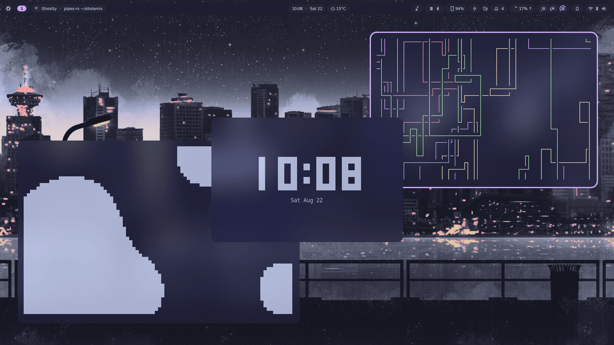
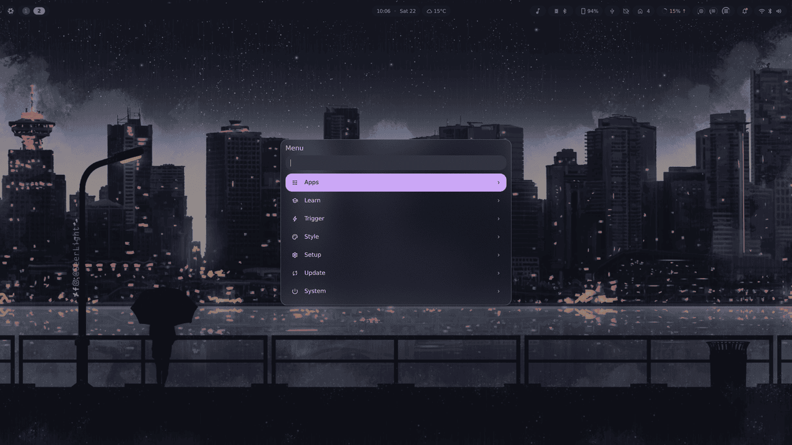

<div align="center">

# ❄️ sitolamix

**Personal NixOS flake** — a scrollable Wayland desktop wired together so that
every feature lives in **one file**: system config, home-manager, and its
enable-switch, side by side.

[](https://nixos.org)
[](https://github.com/YaLTeR/niri)
[](https://github.com/AvengeMedia/DankMaterialShell)
[](https://github.com/nix-community/home-manager)
[](https://github.com/nix-community/stylix)

</div>

<div align="center">



<em>niri + DankMaterialShell — floating terminal toys, blur, one catppuccin palette everywhere</em>

</div>

---

## Overview

A single-user NixOS configuration built on three ideas:

- **One file per feature.** A module declares its `enable` option, gates its
  system config with `lib.mkIf`, *and* folds in its home-manager config — no
  parallel `home/` tree to keep in sync.
- **Nothing is imported by hand.** Every `.nix` under `modules/` is
  auto-imported; every folder under `hosts/` is auto-discovered. Adding a
  machine is adding a directory.
- **Suites over sprawl.** Hosts don't enable 40 options — they flip a handful of
  suites (`core`, `desktop`, `development`, …) that each switch on a batch.

## 🧩 Stack

| Layer | Choice |
|---|---|
| **Compositor** | [niri](https://github.com/YaLTeR/niri) — scrollable-tiling Wayland |
| **Shell / bar** | [DankMaterialShell](https://github.com/AvengeMedia/DankMaterialShell) (Quickshell) — bar, control center, notifications, lock screen, blur, plugins |
| **Launcher** | [dankMenu](https://github.com/sitolam/dms-plugins/tree/main/plugins/dankmenu) (`Mod+Space`) — omarchy-style root menu: one key to every command, with its own search and app list |
| **Terminal** | [ghostty](https://ghostty.org/) |
| **Login shell** | fish + [starship](https://starship.rs/) |
| **Files** | GNOME Files (nautilus) |
| **Browser** | helium |
| **Idle / lock** | swayidle → lock · DPMS · suspend (pauses while media plays) |
| **Theming** | [stylix](https://github.com/nix-community/stylix) — fixed `catppuccin-mocha` base16; every themable app follows |
| **Greeter** | [dank-greeter](https://github.com/AvengeMedia/dank-greeter) — greetd + DMS's own login screen, drawn per-output by the same niri build as the session, wearing a copy of the desktop's theme |
| **Keyboard** | [kanata](https://github.com/jtroo/kanata) home-row mods, system-wide |
| **Fonts** | Nerd Fonts + the Microsoft sets (corefonts, vista-fonts) so foreign documents keep their metrics |
| **Boot** | GRUB EFI + [catppuccin-grub](https://github.com/catppuccin/grub) |
| **Kernel** | linux-zen |

## ✨ Party tricks

Things this config does that a stock desktop does not:

- 🦷 **Mouth guard** — a webcam watches whether your mouth stays closed and nags
  from the bar when it doesn't ([`dms-plugins/mouthguard`](https://github.com/sitolam/dms-plugins/tree/main/plugins/mouthguard),
  dlib + OpenCV, built straight from the flake input).
- 🗂️ **One key to everything** — `Mod+Space` opens an omarchy-style root menu:
  drill in with `Enter`, out with `Esc`, or just type and it searches every
  command in the tree *and* every installed app
  ([`dms-plugins/dankmenu`](https://github.com/sitolam/dms-plugins/tree/main/plugins/dankmenu)).
  Its tree is generated from this flake, so `Update ▸ Rebuild` runs against this
  very checkout.

  
- ⌨️ **Home-row mods** — kanata turns `asdf`/`jkl;` into modifiers on hold, caps
  into Esc on tap, and holding `v` into a vim arrow layer — all of it below the
  compositor, so every app obeys.
- 🗃 **Scratchpad** — `Mod+M` stashes the focused window away, `Mod+S` floats it
  back (`niri-scratchpad`).
- 💡 **DDC brightness** — the brightness keys drive the *external* monitors over
  i2c, one `dms ipc` call per panel.
- 🤖 **Claude Code, two ways** — a bar widget that tracks API usage, and `ccl`,
  which points Claude Code at a model running locally in LM Studio.
- 🎧 **Bar full of plugins** — typing sounds, take-a-break, ambient sound, USB
  manager, KDE Connect, Home Assistant, emoji launcher, calculator.
- 🔒 **Lock before sleep** — swayidle locks, then suspends, and pauses the whole
  chain while media is playing.

## ⌨️ Keybinds

<details>
<summary><code>Mod</code> is Super. <code>Mod+Slash</code> opens DMS's own searchable cheat sheet — this is the short version.</summary>

<br>

| Shell | |
|---|---|
| `Mod+Space` | dankMenu — root menu; `Enter`/`Esc` in and out, `Ctrl+HJKL` for vim navigation, type to search everything below |
| `Mod+D` | dashboard / dank dash |
| `Mod+V` · `Mod+P` · `Mod+N` | clipboard · notepad · notifications |
| `Mod+Ctrl+S` · `Mod+Ctrl+M` | control center · process list |
| `Mod+Shift+Period` | emoji picker |
| `Mod+Shift+T` · `Mod+Shift+W` · `Mod+Alt+N` | theme · wallpaper · night mode |

| Windows | |
|---|---|
| `Mod+←/→` · `Mod+↑/↓` | focus column · focus window in column |
| `Mod+Ctrl+←/→/↑/↓` | move it |
| `Mod+Q` · `Mod+F` · `Mod+Shift+F` | close · maximise column · fullscreen |
| `Mod+W` · `Mod+A` · `Mod+C` | float · tabbed column · center column |
| `Mod+[` / `Mod+]` | consume / expel a window sideways |
| `Mod+R` · `Mod+-` / `Mod+=` | preset widths · resize by 10% |
| `Mod+O` · `Mod+Tab` | overview · previous workspace |
| `Mod+M` / `Mod+S` | scratchpad: stash / bring back |

| Apps & capture | |
|---|---|
| `Mod+T` · `Mod+B` · `Mod+E` | ghostty · helium · files |
| `Mod+Shift+G` · `Mod+Shift+M` | lazygit · btop, in a terminal |
| `Mod+Shift+S` · `Print` | capture toolbar · full screenshot |
| `Mod+Print` · `Mod+Shift+O` · `Mod+Shift+C` | region → clipboard · region **OCR** → clipboard · colour pick |

| Session | |
|---|---|
| `Mod+BackSpace` | lock |
| `Mod+Shift+BackSpace` | lock + suspend |
| `Mod+Ctrl+BackSpace` | power menu |
| `Mod+Shift+P` | monitors off |

Defined in `modules/desktop/niri/bindings.nix`.

</details>

## 🕹 Terminal toys

Because a tiling desktop deserves something in the empty column. The
animations and clocks ride along with the CLI tools in `modules/apps/cli.nix`;
`cliamp` and `cava` are media apps, so they live in `suites.media`:

| | |
|---|---|
| `cava` | audio visualiser — the same one the bar's widget uses |
| `lavat -g -c FF6AC1 -k 6AC1FF -G` | lava lamp: truecolor gradient, metaballs that rise and fall. `-p p1` for party mode |
| `pipes-rs` | the pipes screensaver, endlessly plumbing |
| `peaclock` | clock / timer / stopwatch, styled from its own config |
| `tty-clock -c -C 5` | the classic centred big-digit clock |
| `cbonsai -l` | grows a bonsai, live |
| `cmatrix -ab` | the green rain |
| `asciiquarium` | fish tank |
| `cliamp` | Winamp 2.x as a TUI — playlists, visualiser modes, themes, Lua plugins, Spotify/Qobuz |

## 🖥 Hosts

| Host | Machine |
|---|---|
| `gamingpc` | AMD CPU + NVIDIA GPU workstation — DP-3 primary, HDMI-A-1 secondary. |

## 🗂 Structure

[`flake-parts`](https://flake.parts) + [`import-tree`](https://github.com/vic/import-tree):
every `.nix` under `modules/` is auto-imported into every host — **no manual
imports list** — and hosts under `hosts/<name>/` are **auto-discovered**.

```
flake.nix              flake description + inputs
flake/                 flake-parts modules (systems builder, devshell, formatter)
hosts/<name>/          per-host: default.nix (suite toggles) + hardware.nix
modules/
  hm.nix               home-manager bridge — the `home.extraOptions` mechanism
  system/              always-on baseline (base, nix, locale, users, boot, sops …)
  hardware/            audio / bluetooth / graphics baseline; nvidia gated
  desktop/             niri, dms, stylix, xdg (gated on the desktop suite)
  services/            kde-connect, docker, rclone … (gated)
  apps/                one file per app, each `apps.<name>.enable`
  suites/              groups that flip a batch of enables (core, desktop, dev …)
```

### Enable-options + suites

Each feature declares `options.<ns>.<name>.enable` and gates its config with
`lib.mkIf`. Suites toggle groups of them; hosts just flip suites:

```nix
# hosts/gamingpc/default.nix
suites = {
  core.enable = true;         # shell + CLI programs
  desktop.enable = true;      # niri + dms + stylix + greetd/dank-greeter
  development.enable = true;   # vscode, docker, tooling
  media.enable = true;
  gaming.enable = true;
  # …
};
hardware.nvidia.enable = true;
```

### home-manager in one file

Home-manager runs as a NixOS module (`modules/hm.nix`). Any file mixes system +
HM config by writing `home.extraOptions` — an attrset, or a function
`{ config, … }: { … }` when it needs HM's own `config` (e.g. stylix colors).
It's a `deferredModule`, so every file's contribution merges into
`home-manager.users.otis`. There is no separate `home/` tree.

```nix
{ config, lib, ... }:
{
  options.apps.ghostty.enable = lib.mkEnableOption "ghostty terminal";
  config = lib.mkIf config.apps.ghostty.enable {
    home.extraOptions.programs.ghostty.enable = true;   # home-manager, same file
  };
}
```

## 🔧 Rebuild

```sh
just rebuild        # nh os switch .
just update         # nix flake update + rebuild
just check          # nix flake check --no-build
just drybuild       # dry-run build of the current host
```

Fish also wraps `just` so it works from any cwd (see `modules/apps/fish.nix`).

> [!TIP]
> After a rebuild that touches DankMaterialShell plugins or settings, run
> `dms restart` so the shell reloads them.

## 🔑 GitHub auth

Pushing uses HTTPS with the **GitHub CLI** as the credential helper — no token in
the remote URL, nothing auth-related committed to the repo. On a new machine:

```sh
gh auth login   # GitHub.com → HTTPS → login via browser
```

`gh` stores the token in `~/.config/gh/` (user-only, outside the flake) and wires
itself in as git's credential helper, so `git push` just works afterwards.

## 🔐 Secrets (sops)

<details>
<summary>Encrypted with <b>sops-nix</b> + age, committed as ciphertext, decrypted at activation to <code>/run/secrets/&lt;name&gt;</code> — tmpfs, never in the store or git in plaintext. The config references the decrypted <em>path</em>, never the value.</summary>

<br>

- `modules/system/sops.nix` — imports the sops module, sets the sops file and the
  decryption key (the machine's SSH host key), and declares each secret.
- `.sops.yaml` — the age recipients allowed to decrypt (creation rules).
- `secrets/*.yaml` — the encrypted secret files.

The decryption key is `/etc/ssh/ssh_host_ed25519_key`, converted to age. Get the
matching **public** key (the recipient for `.sops.yaml`) with:

```sh
nix run nixpkgs#ssh-to-age < /etc/ssh/ssh_host_ed25519_key.pub
```

Add / edit a secret (opens `$EDITOR` with decrypted content, re-encrypts on save):

```sh
nix run nixpkgs#sops -- secrets/ha.yaml
```

Then declare it and reference the runtime path:

```nix
# modules/system/sops.nix
sops.secrets.hass_token = { owner = "otis"; mode = "0400"; };

# consumer, e.g. modules/desktop/dms/plugins.nix
config.sops.secrets.hass_token.path   # => /run/secrets/hass_token
```

Adding another machine: add its age key to `.sops.yaml` and run
`sops updatekeys secrets/ha.yaml`. To rotate a secret, edit it as above and
replace the value — the old ciphertext is overwritten.

</details>

## ☁️ Cloud mounts (rclone)

<details>
<summary>Google Drive — and any other rclone remote — mounted at <code>~/Cloud/&lt;remote&gt;</code> by one systemd <b>user</b> service per remote. <em>Which</em> remotes to mount is declared in Nix; the accounts themselves are set up with <code>rclone config</code>, so no OAuth token ever touches the repo.</summary>

<br>

`modules/services/rclone.nix` turns every entry of `services.rclone.remotes`
into its own `rclone-<name>.service`:

```nix
# hosts/gamingpc/default.nix
services.rclone = {
  enable = true;
  remotes.gdrive_personal = { };   # mounts gdrive_personal: at ~/Cloud/gdrive_personal
};
```

### Adding a Google Drive

1. **Make your own OAuth client id** (recommended — the id built into rclone is
   shared by every rclone user on earth and heavily rate-limited):
   [rclone.org → making your own client id](https://rclone.org/drive/#making-your-own-client-id).

2. **Authenticate.** Interactive, once per machine — this is the part that
   *cannot* be declarative:

   ```sh
   rclone config
   ```

   `n` (new remote) → name it (e.g. `gdrive_personal`) → storage `drive` →
   paste `client_id` + `client_secret` → scope `1` (full access) → leave
   root_folder_id / service_account_file empty → `n` (no advanced config) →
   `y` to open a browser and sign in → `n` (not a shared drive) → `q`.
   Full walkthrough: [rclone.org/drive](https://rclone.org/drive/).

3. **Declare it** under `services.rclone.remotes` in `hosts/<host>/default.nix`,
   using the same name, then `just rebuild`.

The mount comes up during the rebuild and at every login afterwards. `rclone
listremotes` shows the names rclone knows about — they must match the
attribute names.

### Everyday use

| Command | |
|---|---|
| `rclone-mounts` | status of every mount (`status` is the default subcommand) |
| `rclone-mounts restart` | remount everything — `reload-rclone` still works too |
| `rclone-mounts start` / `stop` | … one-way |
| `rclone-mounts logs` | follow the journal of all mounts |

### Options

| Option | Default | |
|---|---|---|
| `services.rclone.mountBase` | `%h/Cloud` | parent directory of every mount |
| `services.rclone.configFile` | `%h/.config/rclone/rclone.conf` | |
| `services.rclone.flags` | see below | flags applied to every mount |
| `…remotes.<name>.remote` | `<name>:` | set to `<name>:Sub/Dir` to mount a subfolder |
| `…remotes.<name>.mountPoint` | `<mountBase>/<name>` | |
| `…remotes.<name>.extraFlags` | `[ ]` | flags for this remote only, e.g. `[ "--read-only" ]` |

The default flags worth knowing: `--vfs-cache-mode=full` means files are cached
on disk, so editing in place behaves like a local disk (capped at 5G / 24h), and
`--dir-cache-time=1000h` is paired with `--poll-interval=15s` — Drive supports
change polling, so an effectively infinite directory cache still notices changes
made from your phone or the web UI within seconds.

### Troubleshooting

| Symptom | Fix |
|---|---|
| `Failed to configure token … expired` | `rclone config reconnect <name>:` |
| Unit inactive, mount point empty | `rclone-mounts logs` — usually the name doesn't match `rclone listremotes` |
| `Transport endpoint is not connected` | leftover from a crash; `rclone-mounts restart` clears it (the unit unmounts stale mount points before starting) |
| Nothing started at all | the unit is *skipped* while `~/.config/rclone/rclone.conf` doesn't exist — run `rclone config` first |

> [!IMPORTANT]
> `~/.config/rclone/rclone.conf` holds live OAuth refresh tokens. It stays in
> `$HOME` at mode `600` and must never be committed — this repo is public.

</details>

## 🤖 Local models (ccl)

<details>
<summary><code>ccl</code> runs Claude Code against a model served by LM Studio instead of Anthropic's API — LM Studio speaks the OpenAI API, Claude Code speaks Anthropic's, and <a href="https://github.com/musistudio/claude-code-router">claude-code-router</a> sits between them and translates. <code>ccl</code> picks the model, configures the router, starts it, and hands off.</summary>

<br>

Enabled by `suites.ai.enable`.

### Everyday use

```
ccl                            pick a model interactively, then launch
ccl <model-id>                 launch with a specific model
ccl --list                     list selectable models and exit
ccl --print-config <model-id>  print the router config without writing it
ccl <model-id> -- --version    pass everything after -- to claude
ccl -h                         usage summary
```

Start LM Studio and load a model first — `ccl` only lists what LM Studio reports.

The router runs detached from `ccl` and from your shell: once started it keeps
serving in the background, surviving Ctrl-C, closing the terminal, and quitting
Claude Code. Relaunching `ccl` with the same model reuses it instantly; a different
model restarts it. It only stops when you run `ccr stop`, or at logout.

### Options

| Variable | Default | Meaning |
|---|---|---|
| `CCL_LMSTUDIO_URL` | `http://127.0.0.1:1234` | LM Studio base URL |
| `CCL_ROUTER_PORT` | `4141` | Port the router listens on |

`ccl` owns `~/.claude-code-router/config.json` and rewrites it on every launch. A
config it did not write is preserved once as `config.json.pre-ccl`.

### Troubleshooting

**"LM Studio is not answering"** — LM Studio's local server is off. Developer tab →
Status: Running.

**Context warning at launch** — the model was loaded with too small a context window.
Claude Code's system prompt and tool definitions alone exceed a few thousand tokens.
Raise "Context Length" in the model's settings in LM Studio and reload it.

**"the router never became healthy"** — something else holds port 4141, or the router
rejected the config. The message includes the tail of the router's log.

**Picked a `○ not-loaded` model and Claude Code hangs** — LM Studio loads it on the
first request, which can take minutes for a large model. `ccl` says so at launch;
wait it out, or load the model in LM Studio before starting.

**A not-loaded model still ran out of context** — for those, `ccl` can only see the
model's ceiling (`max_context_length`), not the context LM Studio will actually load
it with, so the context warning can stay silent and the session fail anyway. Load the
model in LM Studio first and `ccl --list` will show its real context.

**Malformed tool calls, or the session derails** — expected with small quantised
models. Claude Code leans hard on well-formed tool calls; a 3-bit quant will not
always produce them. This is the model, not `ccl`.

</details>

## 📎 Attribution

The HM + NixOS same-file mechanism (`home.extraOptions` + deferred module) and
the enable-options / suites layout are adapted from a previous personal repo,
`quickhyprnix`.

<div align="center"><sub>Built with Nix · themed with stylix · broken and fixed on <code>main</code></sub></div>
