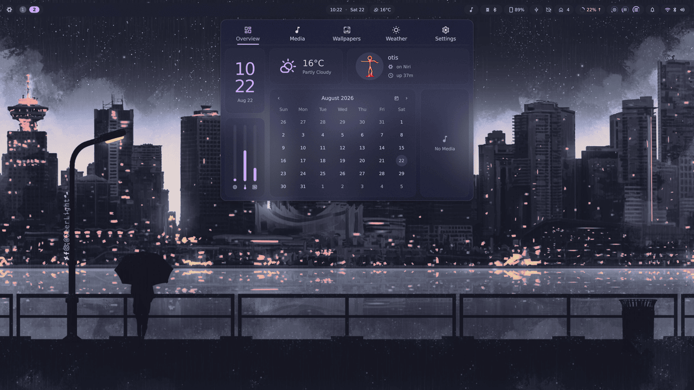
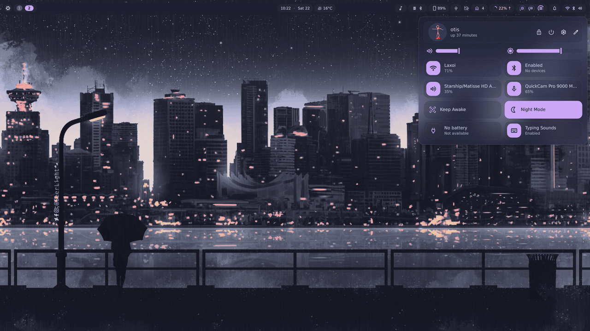
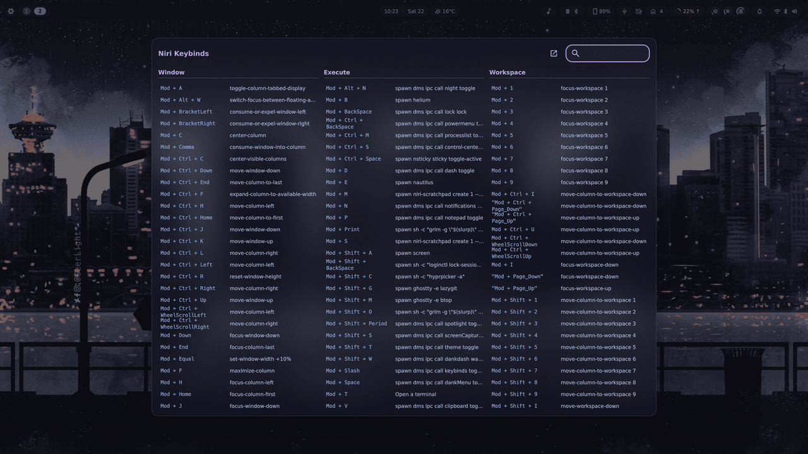
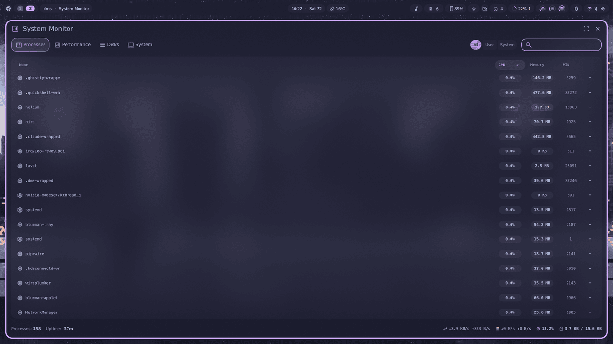

<div align="center">

# ❄️ sitolamix

**Personal NixOS flake** — a scrollable Wayland desktop wired together so that
every feature lives in **one file**: system config, home-manager, and its
enable-switch, side by side.

[](https://nixos.org)
[](https://github.com/YaLTeR/niri)
[](https://github.com/AvengeMedia/DankMaterialShell)
[](https://github.com/nix-community/home-manager)
[](https://github.com/nix-community/stylix)

</div>

<div align="center">


<em>niri + DankMaterialShell — floating terminal toys, blur, one catppuccin palette everywhere</em>

</div>

<details>
<summary><strong>More screenshots</strong> — the menu, the panels, the cheat sheet</summary>

<br>

<div align="center">

**`Mod+Space` — dankMenu**, the root menu: type to search every command *and* every app


**`Mod+D` — dank dash**: clock, weather, calendar, session and resource gauges in one panel



**`Mod+Ctrl+S` — control center**: network, bluetooth, audio, brightness and the plugin toggles



**`Mod+Slash` — the keybind cheat sheet**, generated from the niri config itself



**`Mod+Ctrl+M` — system monitor**: processes, performance, disks



</div>

</details>

---

## Overview

A single-user NixOS configuration built on three ideas:

- **One file per feature.** A module declares its `enable` option, gates its
  system config with `lib.mkIf`, *and* folds in its home-manager config — no
  parallel `home/` tree to keep in sync.
- **Nothing is imported by hand.** Every `.nix` under `modules/` is
  auto-imported; every folder under `hosts/` is auto-discovered. Adding a
  machine is adding a directory.
- **Suites over sprawl.** Hosts don't enable 40 options — they flip a handful of
  suites (`core`, `desktop`, `development`, …) that each switch on a batch.

## 🧩 Stack

| Layer | Choice |
|---|---|
| **Compositor** | [niri](https://github.com/YaLTeR/niri) — scrollable-tiling Wayland |
| **Shell / bar** | [DankMaterialShell](https://github.com/AvengeMedia/DankMaterialShell) (Quickshell) — bar, control center, notifications, lock screen, blur, plugins |
| **Launcher** | [dankMenu](https://github.com/sitolam/dms-plugins/tree/main/plugins/dankmenu) (`Mod+Space`) — omarchy-style root menu: one key to every command, with its own search and app list |
| **Terminal** | [ghostty](https://ghostty.org/) |
| **Login shell** | fish + [starship](https://starship.rs/) |
| **Files** | GNOME Files (nautilus) |
| **Browser** | helium |
| **Idle / lock** | swayidle → lock · DPMS · suspend (pauses while media plays) |
| **Theming** | [stylix](https://github.com/nix-community/stylix) — fixed `catppuccin-mocha` base16; every themable app follows |
| **Greeter** | [dank-greeter](https://github.com/AvengeMedia/dank-greeter) — greetd + DMS's own login screen, drawn per-output by the same niri build as the session, wearing a copy of the desktop's theme |
| **Keyboard** | [kanata](https://github.com/jtroo/kanata) home-row mods, system-wide |
| **Fonts** | Nerd Fonts + the Microsoft sets (corefonts, vista-fonts) so foreign documents keep their metrics |
| **Boot** | GRUB EFI + [catppuccin-grub](https://github.com/catppuccin/grub) |
| **Kernel** | linux-zen |

## ✨ Party tricks

Things this config does that a stock desktop does not:

- 🦷 **Mouth guard** — a webcam watches whether your mouth stays closed and nags
  from the bar when it doesn't ([`dms-plugins/mouthguard`](https://github.com/sitolam/dms-plugins/tree/main/plugins/mouthguard),
  dlib + OpenCV, built straight from the flake input).
- 🗂️ **One key to everything** — `Mod+Space` opens an omarchy-style root menu:
  drill in with `Enter`, out with `Esc`, or just type and it searches every
  command in the tree *and* every installed app
  ([`dms-plugins/dankmenu`](https://github.com/sitolam/dms-plugins/tree/main/plugins/dankmenu)).
  Its tree is generated from this flake, so `Update ▸ Rebuild` runs against this
  very checkout.

  
- ⌨️ **Home-row mods** — kanata turns `asdf`/`jkl;` into modifiers on hold, caps
  into Esc on tap, and holding `v` into a vim arrow layer — all of it below the
  compositor, so every app obeys.
- 🗃 **Scratchpad** — `Mod+M` stashes the focused window away, `Mod+S` floats it
  back (`niri-scratchpad`).
- 💡 **DDC brightness** — the brightness keys drive the *external* monitors over
  i2c, one `dms ipc` call per panel.
- 🤖 **Claude Code, two ways** — a bar widget that tracks API usage, and `ccl`,
  which points Claude Code at a model running locally in LM Studio.
- 🎧 **Bar full of plugins** — typing sounds, take-a-break, ambient sound, USB
  manager, KDE Connect, Home Assistant, emoji launcher, calculator.
- 🔒 **Lock before sleep** — swayidle locks, then suspends, and pauses the whole
  chain while media is playing.

## ⌨️ Keybinds

<details>
<summary><code>Mod</code> is Super. <code>Mod+Slash</code> opens DMS's own searchable cheat sheet — this is the short version.</summary>

<br>

| Shell | |
|---|---|
| `Mod+Space` | dankMenu — root menu; `Enter`/`Esc` in and out, `Ctrl+HJKL` for vim navigation, type to search everything below |
| `Mod+D` | dashboard / dank dash |
| `Mod+V` · `Mod+P` · `Mod+N` | clipboard · notepad · notifications |
| `Mod+Ctrl+S` · `Mod+Ctrl+M` | control center · process list |
| `Mod+Shift+Period` | emoji picker |
| `Mod+Shift+T` · `Mod+Shift+W` · `Mod+Alt+N` | theme · wallpaper · night mode |

| Windows | |
|---|---|
| `Mod+←/→` · `Mod+↑/↓` | focus column · focus window in column |
| `Mod+Ctrl+←/→/↑/↓` | move it |
| `Mod+Q` · `Mod+F` · `Mod+Shift+F` | close · maximise column · fullscreen |
| `Mod+W` · `Mod+A` · `Mod+C` | float · tabbed column · center column |
| `Mod+[` / `Mod+]` | consume / expel a window sideways |
| `Mod+R` · `Mod+-` / `Mod+=` | preset widths · resize by 10% |
| `Mod+O` · `Mod+Tab` | overview · previous workspace |
| `Mod+M` / `Mod+S` | scratchpad: stash / bring back |

| Apps & capture | |
|---|---|
| `Mod+T` · `Mod+B` · `Mod+E` | ghostty · helium · files |
| `Mod+Shift+G` · `Mod+Shift+M` | lazygit · btop, in a terminal |
| `Mod+Shift+S` · `Print` | capture toolbar · full screenshot |
| `Mod+Print` · `Mod+Shift+O` · `Mod+Shift+C` | region → clipboard · region **OCR** → clipboard · colour pick |

| Session | |
|---|---|
| `Mod+BackSpace` | lock |
| `Mod+Shift+BackSpace` | lock + suspend |
| `Mod+Ctrl+BackSpace` | power menu |
| `Mod+Shift+P` | monitors off |

Defined in `modules/desktop/niri/bindings.nix`.

</details>

## 🕹 Terminal toys

Because a tiling desktop deserves something in the empty column. The
animations and clocks ride along with the CLI tools in `modules/apps/cli.nix`;
`cliamp` and `cava` are media apps, so they live in `suites.media`:

| | |
|---|---|
| `cava` | audio visualiser — the same one the bar's widget uses |
| `lavat -g -c FF6AC1 -k 6AC1FF -G` | lava lamp: truecolor gradient, metaballs that rise and fall. `-p p1` for party mode |
| `pipes-rs` | the pipes screensaver, endlessly plumbing |
| `peaclock` | clock / timer / stopwatch, styled from its own config |
| `tty-clock -c -C 5` | the classic centred big-digit clock |
| `cbonsai -l` | grows a bonsai, live |
| `cmatrix -ab` | the green rain |
| `asciiquarium` | fish tank |
| `cliamp` | Winamp 2.x as a TUI — playlists, visualiser modes, themes, Lua plugins, Spotify/Qobuz |

## 🖥 Hosts

| Host | Machine |
|---|---|
| `gamingpc` | AMD CPU + NVIDIA GPU workstation — DP-3 primary, HDMI-A-1 secondary. |
| `omnibook` | HP OmniBook laptop — Intel Core Ultra X7 358H (Panther Lake), Xe3 iGPU, LUKS+LVM root, IR face unlock. |

## 🗂 Structure

[`flake-parts`](https://flake.parts) + [`import-tree`](https://github.com/vic/import-tree):
every `.nix` under `modules/` is auto-imported into every host — **no manual
imports list** — and hosts under `hosts/<name>/` are **auto-discovered**.

```
flake.nix              flake description + inputs
flake/                 flake-parts modules (systems builder, devshell, formatter)
hosts/<name>/          per-host: default.nix (suite toggles) + hardware.nix
modules/
  hm.nix               home-manager bridge — the `home.extraOptions` mechanism
  system/              always-on baseline (base, nix, locale, users, boot, sops, openssh …)
  hardware/            audio / bluetooth / graphics baseline; nvidia gated
  desktop/             niri, dms, stylix, xdg (gated on the desktop suite)
  services/            kde-connect, docker, rclone … (gated)
  apps/                one file per app, each `apps.<name>.enable`
  suites/              groups that flip a batch of enables (core, desktop, dev …)
```

### Enable-options + suites

Each feature declares `options.<ns>.<name>.enable` and gates its config with
`lib.mkIf`. Suites toggle groups of them; hosts just flip suites:

```nix
# hosts/gamingpc/default.nix
suites = {
  core.enable = true;         # shell + CLI programs
  desktop.enable = true;      # niri + dms + stylix + greetd/dank-greeter
  development.enable = true;   # vscode, docker, tooling
  media.enable = true;
  gaming.enable = true;
  # …
};
hardware.nvidia.enable = true;
```

### home-manager in one file

Home-manager runs as a NixOS module (`modules/hm.nix`). Any file mixes system +
HM config by writing `home.extraOptions` — an attrset, or a function
`{ config, … }: { … }` when it needs HM's own `config` (e.g. stylix colors).
It's a `deferredModule`, so every file's contribution merges into
`home-manager.users.otis`. There is no separate `home/` tree.

```nix
{ config, lib, ... }:
{
  options.apps.ghostty.enable = lib.mkEnableOption "ghostty terminal";
  config = lib.mkIf config.apps.ghostty.enable {
    home.extraOptions.programs.ghostty.enable = true;   # home-manager, same file
  };
}
```

## 💾 Install

> [!WARNING]
> This is a personal config, not a distro. It hardcodes the username **`otis`**
> (21 references across 9 files — `grep -rn otis modules/`), and
> `hosts/gamingpc/hardware.nix` describes one specific machine: NVMe, AMD CPU,
> NVIDIA GPU. Installing it unchanged gives you *my* machine's assumptions.
> Fork it, or at minimum give your machine its own host directory.

> [!TIP]
> Installing `omnibook` specifically? [`docs/omnibook-install.md`](docs/omnibook-install.md)
> is the same procedure written end-to-end for that machine — encrypted layout,
> firmware settings, BitLocker warning, howdy enrollment, and what to do on
> `gamingpc` first.

### 1. Boot the installer

Any recent [NixOS ISO](https://nixos.org/download/) (graphical or minimal).
Get networking up — `nmtui` on the minimal image — and become root: `sudo -i`.

**On an HP laptop (`omnibook`), change two firmware settings first** — F10 at
the HP logo:

- **Secure Boot → off.** This flake has no lanzaboote/shim setup, so a
  Secure-Boot-enabled machine refuses to boot the installer *and* the installed
  system.
- **Storage / SATA mode → AHCI**, not Intel RST (VMD). HP ships RST on, and
  with it the NVMe does not appear in `lsblk` at all — there is nothing to
  partition. `hosts/omnibook/hardware.nix` also carries the `vmd` initrd module
  so a system installed in RST mode still boots, but AHCI is the setting you
  want.

> [!WARNING]
> **Save your BitLocker recovery key before changing either setting.** Windows 11
> on an HP laptop seals the BitLocker key to the TPM, and both changes above
> alter the TPM's PCR measurements, which breaks that seal. The next Windows
> boot then demands a 48-digit recovery key instead of unlocking silently.
>
> Irrelevant for a wipe — fatal if you wanted to boot Windows once more to copy
> files off. So either get your data off first, or grab the key:
> `manage-bde -protectors -get C:` in an admin shell, or
> <https://account.microsoft.com/devices/recoverykey>.

Windows will not boot after the AHCI switch. That is fine here — `omnibook` is
a wipe install. If you ever want it back, put the mode back to RST.

### 2. Partition, and **label the partitions**

The labels are the whole trick: `hardware.nix` mounts
`/dev/disk/by-label/NIXROOT` rather than a UUID, so the same file works on any
disk that uses these three names.

| label | mount | filesystem |
| --- | --- | --- |
| `NIXBOOT` | `/boot` | fat32, ESP, ~1 GiB |
| `NIXSWAP` | swap | swap, ~RAM-sized if you want hibernate |
| `NIXROOT` | `/` | ext4, the rest |

GParted works if you prefer clicking — just set those three labels. On the CLI,
for a disk at `/dev/nvme0n1` (**this erases it**):

```sh
parted /dev/nvme0n1 -- mklabel gpt
parted /dev/nvme0n1 -- mkpart ESP fat32 1MiB 1GiB
parted /dev/nvme0n1 -- set 1 esp on
parted /dev/nvme0n1 -- mkpart swap linux-swap 1GiB 17GiB
parted /dev/nvme0n1 -- mkpart root ext4 17GiB 100%

mkfs.fat -F32 -n NIXBOOT /dev/nvme0n1p1
mkswap        -L NIXSWAP /dev/nvme0n1p2
mkfs.ext4     -L NIXROOT /dev/nvme0n1p3
```

Mount them:

```sh
mount /dev/disk/by-label/NIXROOT /mnt
mkdir -p /mnt/boot
mount -o umask=077 /dev/disk/by-label/NIXBOOT /mnt/boot
swapon /dev/disk/by-label/NIXSWAP
```

#### On `omnibook` — encrypted, so a different layout

The laptop leaves the house, so it gets full-disk encryption and the desktop
doesn't. The concrete reason, beyond the obvious: `modules/system/sops.nix`
decrypts `secrets/ha.yaml` with `/etc/ssh/ssh_host_ed25519_key`. On a plain
disk, whoever walks off with the machine mounts it, reads that key, and has your
Home Assistant token.

LUKS2 with LVM inside it, one passphrase for the lot:

```
nvme0n1p1  NIXBOOT   vfat ESP, /boot, unencrypted
nvme0n1p2  NIXCRYPT  LUKS2
           └─ vg0    LVM
              ├─ swap  32G   (= RAM, so hibernate has somewhere to land)
              └─ root  rest, ext4
```

`/boot` stays outside the container so GRUB never touches an encrypted volume —
no `enableCryptodisk`, no second prompt. GRUB loads the kernel and initrd, then
the initrd asks for the passphrase once.

```sh
parted /dev/nvme0n1 -- mklabel gpt
parted /dev/nvme0n1 -- mkpart NIXBOOT fat32 1MiB 1GiB
parted /dev/nvme0n1 -- set 1 esp on
parted /dev/nvme0n1 -- mkpart NIXCRYPT 1GiB 100%

mkfs.fat -F32 -n NIXBOOT /dev/nvme0n1p1

# LUKS2. Choose a passphrase you can type at a bare console — this prompt has
# no keymap loaded yet, so it is US-QWERTY regardless of your layout.
cryptsetup luksFormat --type luks2 /dev/nvme0n1p2
cryptsetup open /dev/nvme0n1p2 cryptroot

# LVM inside it
pvcreate /dev/mapper/cryptroot
vgcreate vg0 /dev/mapper/cryptroot
lvcreate -L 32G -n swap vg0
lvcreate -l 100%FREE -n root vg0

mkfs.ext4 -L NIXROOT /dev/vg0/root
mkswap    -L NIXSWAP /dev/vg0/swap
```

The partition *names* matter here, not filesystem labels:
`hosts/omnibook/hardware.nix` opens `/dev/disk/by-partlabel/NIXCRYPT`, which is
the GPT name `parted -- mkpart NIXCRYPT` sets. A LUKS container has no
filesystem label of its own to use instead.

Mount:

```sh
mount /dev/vg0/root /mnt
mkdir -p /mnt/boot
mount -o umask=077 /dev/disk/by-label/NIXBOOT /mnt/boot
swapon /dev/vg0/swap
```

> [!NOTE]
> The 32G swap LV is sized for 32 GB of RAM, so hibernate works. `hardware.nix`
> sets `boot.resumeDevice` explicitly — systemd stage 1 (the nixpkgs default
> now) only passes `resume=` to the kernel when that option is set, unlike the
> old scripted stage 1 which inferred it from `swapDevices`. Miss it and
> hibernate half-works: the image is written, and the next boot ignores it.

### 3. Give your machine a host

The flake lives in your home directory, not `/etc/nixos` — clone it straight to
where it will live after boot, so nothing has to be moved later:

```sh
nix-shell -p git
mkdir -p /mnt/home/otis
git clone https://github.com/sitolam/sitolamix /mnt/home/otis/sitolamix
cd /mnt/home/otis/sitolamix

mkdir -p hosts/myhost
nixos-generate-config --root /mnt --show-hardware-config > hosts/myhost/hardware.nix
cp hosts/gamingpc/default.nix hosts/myhost/default.nix
```

Then edit `hosts/myhost/default.nix`: set `networking.hostName = "myhost"`,
drop `hardware.nvidia.enable` if you have no NVIDIA card, drop the `rclone`
block, and turn off any suites you don't want. Hosts are auto-discovered, so
creating the directory is all the registration there is.

If you labelled your partitions as above, you can replace the generated
`fileSystems` blocks in `hosts/myhost/hardware.nix` with the by-label ones from
`hosts/gamingpc/hardware.nix` — the generated UUIDs work fine too, they're just
tied to that one disk.

### 4. Re-key the secrets *before* installing

`modules/system/sops.nix` decrypts `secrets/ha.yaml` with **this machine's SSH
host key**, converted to age. A new machine has a different key, so it is not a
recipient and the build fails. You have to add it as one.

There is an ordering trap: the installed system generates its host key on first
boot (`modules/system/openssh.nix`), but you need that key *before* installing,
to add it as a recipient. It goes away if you create the key yourself, in the
installer:

```sh
mkdir -p /mnt/etc/ssh
ssh-keygen -t ed25519 -N "" -C "myhost" -f /mnt/etc/ssh/ssh_host_ed25519_key
chmod 600 /mnt/etc/ssh/ssh_host_ed25519_key
```

NixOS preserves an existing host key rather than replacing it, so this is the
key the installed system will decrypt with — sshd adopts it instead of making
its own. **Back it up** to a USB stick or a password manager — not to the other
machine, which would put both machines' keys on one disk for no benefit. Lose it
and the encrypted secrets are unrecoverable from the new machine.

Now turn it into an age recipient:

```sh
nix run nixpkgs#ssh-to-age < /mnt/etc/ssh/ssh_host_ed25519_key.pub
# age1... — copy this
```

### Which key is which — nothing gets copied between machines

This is the part that reads as confusing. There are **two** host keys, one per
machine, and neither ever moves:

| Key | Lives on | Travels? |
| --- | --- | --- |
| `gamingpc`'s `/etc/ssh/ssh_host_ed25519_key` | gamingpc, since its own install | Never |
| `the new machine`'s `/mnt/etc/ssh/ssh_host_ed25519_key` | the new machine (`/mnt/...` while you are in the installer) | Never |

The only thing that crosses the room is the `age1…` **recipient string** — the
public half, derived from the `.pub` file. Public is fine on paper, in git,
anywhere.

So why does `gamingpc`'s own private key come into it? Because adding a
recipient is two operations, not one:

1. **decrypt** `secrets/ha.yaml` — which needs a key that is *already* a
   recipient, i.e. gamingpc's
2. re-encrypt the result to both recipients

Step 1 is where it fails if sops cannot find gamingpc's key. That failure is
about the *old* key, not the new one, even though the error appears right after
sops has offered to add the new recipient — which is what makes it look like
the new key is at fault.

Adding someone to a shared safe: you need *your* key to open it and *their*
address to add them. Neither key changes hands.

**On a machine that can already decrypt** (your existing install — do this
before wiping it, or from any other machine already listed), add that recipient
to `.sops.yaml`:

```yaml
keys:
  - &gamingpc age1lag4wn9wz90qmfkwcgq55sg56htag4hpfnkxj4ur0mm0txwr4yeq7xpsrr
  - &myhost   age1...            # the key you just printed
creation_rules:
  - path_regex: secrets/[^/]+\.yaml$
    key_groups:
      - age:
          - *gamingpc
          - *myhost
```

`.sops.yaml` only governs *new* files, so re-encrypt the existing one to the new
recipient list and push.

```sh
just updatekeys secrets/ha.yaml     # asks for sudo, see below

git commit -am "chore(sops): add myhost as a recipient"
git push
```

The recipe handles the part that trips people up: `sops` searches only *user*
key locations (`~/.ssh/`, `~/.config/sops/age/keys.txt`, a handful of env vars),
so on its own it will **not** find the SSH **host** key this repo actually
encrypts to — bare `sops updatekeys` fails with *"Failed to get the data key
required to decrypt the SOPS file"*. And `/etc/ssh/ssh_host_ed25519_key` is
root-only, hence the sudo prompt. `just updatekeys` converts it to age and
passes it to that one command only. Don't run `sops` under `sudo` instead — it
works, but rewrites the file as root inside your checkout.

Then back in the installer, pull that commit into the clone:

```sh
cd /mnt/home/otis/sitolamix && git pull
```

Both machines can now decrypt, and the install will succeed.

<details>
<summary><strong>No machine that can decrypt?</strong> (forking, or the old key is gone)</summary>

<br>

Then the existing ciphertext is unreadable to you — nobody can re-key a secret
they cannot read. Start your own:

```sh
# .sops.yaml: replace the gamingpc key with your own recipient, then
rm secrets/ha.yaml
nix run nixpkgs#sops -- secrets/ha.yaml     # opens $EDITOR, writes fresh ciphertext
```

Put a `hass_token:` key in it to match what `modules/system/sops.nix` declares.
If you have no Home Assistant at all, delete `modules/system/sops.nix` **and**
the `homeAssistantMonitor` block plus the `haTokenPath` binding in
`modules/desktop/dms/plugins.nix` — both, because `plugins.nix` reads
`config.sops.secrets.hass_token.path` and removing only the module breaks
evaluation.

</details>

### 5. Install

The installer ISO ships with flakes disabled, so enable them for this shell
first — this covers `nixos-install --flake` and any `nix run` in step 4:

```sh
export NIX_CONFIG="experimental-features = nix-command flakes"
```

```sh
nixos-install --flake /mnt/home/otis/sitolamix#myhost   # or #omnibook
```

This builds the whole system, so expect a long first run and a lot of
downloading. Set a password for the user before rebooting, or greetd will have
nothing to let you in with:

```sh
nixos-enter --root /mnt -c 'passwd otis'
reboot
```

### 6. After first boot

```sh
gh auth login              # so `git push` works — see GitHub auth below
rclone config              # only if you kept services.rclone
```

On `omnibook`, face unlock still needs a one-off enrollment on the machine —
see [Face unlock](#-face-unlock-howdy) below.

The checkout is already at `~/sitolamix`, which is what the dankMenu
`Update ▸ Rebuild` rows assume (`flakeDir` in
`modules/desktop/dms/plugins.nix`). It was cloned as root, so take ownership
once:

```sh
sudo chown -R otis:users ~/sitolamix
```

From then on it is `just rebuild` from that directory. Monitors are configured
in DMS's settings UI, not in the flake.

### Just trying it out?

You don't have to install anything to look at it. Build the system closure on
any NixOS machine:

```sh
nix build github:sitolam/sitolamix#nixosConfigurations.gamingpc.config.system.build.toplevel
```

Or cherry-pick: the modules are self-contained enough that copying
`modules/desktop/dms/` or a single `modules/apps/*.nix` into your own config
usually works with only the `home.extraOptions` bridge (`modules/hm.nix`) to
port along with it.

## 🔧 Rebuild

```sh
just rebuild        # nh os switch .
just update         # nix flake update + rebuild
just check          # nix flake check --no-build
just drybuild       # dry-run build of the current host
```

Fish also wraps `just` so it works from any cwd (see `modules/apps/fish.nix`).

> [!TIP]
> After a rebuild that touches DankMaterialShell plugins or settings, run
> `dms restart` so the shell reloads them.

## 🔑 GitHub auth

Pushing uses HTTPS with the **GitHub CLI** as the credential helper — no token in
the remote URL, nothing auth-related committed to the repo. On a new machine:

```sh
gh auth login   # GitHub.com → HTTPS → login via browser
```

`gh` stores the token in `~/.config/gh/` (user-only, outside the flake) and wires
itself in as git's credential helper, so `git push` just works afterwards.

## 🔐 Secrets (sops)

<details>
<summary>Encrypted with <b>sops-nix</b> + age, committed as ciphertext, decrypted at activation to <code>/run/secrets/&lt;name&gt;</code> — tmpfs, never in the store or git in plaintext. The config references the decrypted <em>path</em>, never the value.</summary>

<br>

- `modules/system/sops.nix` — imports the sops module, sets the sops file and the
  decryption key (the machine's SSH host key), and declares each secret.
- `.sops.yaml` — the age recipients allowed to decrypt (creation rules).
- `secrets/*.yaml` — the encrypted secret files.

The decryption key is `/etc/ssh/ssh_host_ed25519_key`, converted to age — which
is why `modules/system/openssh.nix` is part of the always-on baseline rather
than a suite: sshd is what creates and preserves that key. Get the matching
**public** key (the recipient for `.sops.yaml`) with:

```sh
nix run nixpkgs#ssh-to-age < /etc/ssh/ssh_host_ed25519_key.pub
```

Add / edit a secret (opens `$EDITOR` with decrypted content, re-encrypts on save):

```sh
just secret secrets/ha.yaml
```

The recipe exists because `sops` searches only *user* key locations (`~/.ssh/`,
`~/.config/sops/age/keys.txt`, a few env vars) and so never finds the SSH
**host** key this repo encrypts to — bare `sops secrets/ha.yaml` fails with
*"Failed to get the data key required to decrypt the SOPS file"*. `just secret`
converts `/etc/ssh/ssh_host_ed25519_key` (root-only, so it asks for sudo) to age
and passes it to sops for that one command, without exporting it into your
shell. Don't run `sops` under `sudo` instead — it works, but rewrites the file
as root inside your checkout.

Then declare it and reference the runtime path:

```nix
# modules/system/sops.nix
sops.secrets.hass_token = { owner = "otis"; mode = "0400"; };

# consumer, e.g. modules/desktop/dms/plugins.nix
config.sops.secrets.hass_token.path   # => /run/secrets/hass_token
```

Adding another machine: add its age key to `.sops.yaml`, then re-encrypt every
existing secret to the new recipient list with `just updatekeys secrets/ha.yaml`
(same host-key handling as `just secret`). To rotate a secret, edit it as above
and replace the value — the old ciphertext is overwritten.

</details>

## 🙂 Face unlock (howdy)

<details>
<summary><code>omnibook</code> only — the laptop's Windows Hello IR camera used as a login shortcut, via <a href="https://github.com/boltgolt/howdy">howdy</a>. Convenience, <b>not</b> a security upgrade: read the warning first.</summary>

<br>

> [!WARNING]
> **Howdy is weaker than Windows Hello.** Hello does a depth / structured-light
> liveness check; howdy compares a flat IR image and can be fooled by a
> well-printed photo or a phone screen. Upstream says outright: do not use it as
> your only authentication method.
>
> `modules/hardware/howdy.nix` is wired accordingly:
>
> - `control = "sufficient"` — a face match unlocks, a miss falls *silently
>   through to the password prompt*. Your password never stops working.
> - scoped to **three** PAM services: `login` (which is what the DMS lock screen
>   authenticates against — DMS has no PAM service of its own), `greetd` (the
>   dms-greeter login screen) and `sudo`. Not `sshd`, not everything else —
>   enabling `services.howdy` on its own would default `security.pam.howdy` to
>   *every* service.
> - howdy's own `abort_if_ssh` and `abort_if_lid_closed` guards stay on.
>
> Want it as a real second factor instead? Set
> `hardware.howdy.control = "required"` on the host — then a failed scan
> **blocks** the login rather than falling back.

The config is declarative, the enrollment is not: face models are per-machine
data in `/var/lib/howdy/models`, so they are a post-install step and never live
in the repo.

### 1. Find the IR camera

A Windows Hello module enumerates as *two* V4L2 devices — the colour webcam and
the infrared one. Only the IR node works in the dark, which is the whole point.

```sh
v4l2-ctl --list-devices
```

The IR device is usually the second `/dev/videoN` of the same USB camera. Test a
candidate — this opens a preview and tells you what it sees:

```sh
sudo howdy -U otis test
```

Black frame with the lights off, or "dark image" complaints, means you picked
the colour node (or the emitter is not firing — see step 4).

### 2. Point the config at it

`/etc/howdy/config.ini` is a read-only symlink into the nix store, so
`howdy set` **cannot** work here. Set it in Nix instead:

```nix
# hosts/omnibook/default.nix
hardware.howdy = {
  enable = true;
  device = "/dev/v4l/by-path/pci-0000:00:14.0-usb-0:8:1.0-video-index2";
};
```

Prefer a `/dev/v4l/by-path/…` symlink over a bare `/dev/video2`: the numbering
shifts when another camera is plugged in, and a howdy pointed at the wrong node
just fails every scan. Get the stable path with
`ls -l /dev/v4l/by-path/`. Then `just rebuild`.

### 3. Enrol a face

```sh
sudo howdy -U otis add        # repeat a few times: glasses on, glasses off, dim room
sudo howdy -U otis list       # what is enrolled
sudo howdy -U otis remove 0   # drop one model
```

Lock the session (`Super+L`) to try it. It should unlock on sight, and drop to
the password field if it does not recognise you.

### 4. If the image is black

Some Windows Hello modules need their IR LEDs kicked on explicitly. Symptom: the
device is right, but every frame comes back dark.

```nix
hardware.howdy.irEmitter.enable = true;
```

`just rebuild`, then run the one-off probe — it cycles the camera's vendor
commands until the emitter lights up, and saves what worked:

```sh
sudo linux-enable-ir-emitter configure
```

### Turning it off

```nix
hardware.howdy.enable = false;
```

`just rebuild`, and PAM goes back to password-only immediately. Enrolled models
are left in `/var/lib/howdy/models`; delete the directory if you want them gone.

</details>

## 💤 Idle & hibernate

<details>
<summary><code>omnibook</code> only — lid close and idle both sleep instantly, then hibernate for real after a delay, but only on battery.</summary>

<br>

`modules/desktop/niri/idle.nix` runs the shared swayidle timers (lock at
6 min, blank outputs at 10 min, sleep at 15 min idle). `hosts/omnibook/default.nix`
adds the lid-switch and hibernate-delay config. Both key off
`boot.resumeDevice`, which only omnibook sets (swap sized to RAM in
`hosts/omnibook/hardware.nix`) — so on any other host this is all a no-op and
idle-suspend stays plain `systemctl suspend`.

The behaviour:

- **Lid close or 15 min idle** → `systemctl suspend-then-hibernate`: sleeps
  immediately (RAM suspend), then after `HibernateDelaySec` (30 min) still
  suspended, wakes briefly to write RAM to swap and hibernate for real.
- **On AC power**, hibernate is skipped — plain suspend instead, since there's
  no point burning a resume-from-hibernate on something that's plugged in.
  Lid switch uses logind's `HandleLidSwitchExternalPower`; the idle timer has
  no such built-in, so it greps `/sys/class/power_supply/*/online` itself
  before deciding.

Tune the delay or add a battery-percentage cutoff in
`systemd.sleep.settings.Sleep` (`hosts/omnibook/default.nix`).

</details>

## 🩹 Display glitches (Panther Lake / Xe3)

<details>
<summary><code>omnibook</code> only — the driver stack is right; two of the display engine's power-saving features are not. Recheck after every kernel bump.</summary>

<br>

**The driver side is already correct**, and worth stating plainly so it isn't
re-debugged: `hosts/omnibook/default.nix` sets `hardware.intelgpu.driver =
"xe"` (Panther Lake is xe-only — `common/gpu/intel` from nixos-hardware still
defaults to `i915`, which is wrong here) and
`vaapiDriver = "intel-media-driver"`. `vainfo` reports the iHD driver with
H.264/HEVC/VP9/AV1 decode, and GuC, HuC, GSC and DMC firmware all load. Nothing
about video decode is broken.

**nixos-hardware has no Panther Lake module.** As of the current pin,
`common/cpu/intel/` and `common/gpu/intel/` stop at `lunar-lake` — no
`panther-lake`, and no `hp-omnibook` under the vendor directories either. That
is why the host imports the generic `common-cpu-intel` +
`common-pc-laptop{,-ssd}` stack and sets the two GPU options by hand.
**Recheck this after `nix flake update nixos-hardware`:**

```bash
ls "$(nix eval --raw --impure --expr \
  '(builtins.getFlake (toString ./.)).inputs.nixos-hardware.outPath')/common/cpu/intel"
```

If a `panther-lake` (or `hp/omnibook`) directory shows up, import it and drop
the hand-set `hardware.intelgpu` block — upstream will keep it more current
than we will.

**What actually glitches** is the Xe3 display engine. Two features are buggy on
this panel and are disabled by `boot.kernelParams` in the host file:

| Param | Kernel symptom | What you see |
|---|---|---|
| `xe.enable_psr=0` | `Timed out waiting PSR idle state`, `Selective fetch area calculation failed in pipe A`, `CPU pipe A FIFO underrun` | Half the screen randomly going black or garbled |
| `xe.enable_dsb=0` | `[CRTC:151:pipe A] DSB 0 poll error`, roughly once per vblank — 660k lines in a single boot before the workaround | Stuttering and dropped frames, most obvious in video playback |

Both are display-engine only: rendering, VA-API decode and the NPU are
untouched. Disabling PSR costs a little idle battery, which is the price of a
panel that doesn't tear itself in half.

These are workarounds for driver bugs, not permanent settings. After a kernel
bump, drop one param at a time, reboot, use the machine for a while, and count:

```bash
# `command` bypasses the grep -> rg alias set in modules/apps/fish.nix —
# ripgrep reads -E as --encoding and errors out on this pattern.
journalctl -k -b | command grep -cE "DSB 0 poll error|PSR idle state|FIFO underrun"
```

Zero means the fix landed upstream and the param can stay gone. Anything else,
put it back.

</details>

## ☁️ Cloud mounts (rclone)

<details>
<summary>Google Drive — and any other rclone remote — mounted at <code>~/Cloud/&lt;remote&gt;</code> by one systemd <b>user</b> service per remote. <em>Which</em> remotes to mount is declared in Nix; the accounts themselves are set up with <code>rclone config</code>, so no OAuth token ever touches the repo.</summary>

<br>

`modules/services/rclone.nix` turns every entry of `services.rclone.remotes`
into its own `rclone-<name>.service`:

```nix
# hosts/gamingpc/default.nix
services.rclone = {
  enable = true;
  remotes.gdrive_personal = { };   # mounts gdrive_personal: at ~/Cloud/gdrive_personal
};
```

### Adding a Google Drive

1. **Make your own OAuth client id** (recommended — the id built into rclone is
   shared by every rclone user on earth and heavily rate-limited):
   [rclone.org → making your own client id](https://rclone.org/drive/#making-your-own-client-id).

2. **Authenticate.** Interactive, once per machine — this is the part that
   *cannot* be declarative:

   ```sh
   rclone config
   ```

   `n` (new remote) → name it (e.g. `gdrive_personal`) → storage `drive` →
   paste `client_id` + `client_secret` → scope `1` (full access) → leave
   root_folder_id / service_account_file empty → `n` (no advanced config) →
   `y` to open a browser and sign in → `n` (not a shared drive) → `q`.
   Full walkthrough: [rclone.org/drive](https://rclone.org/drive/).

3. **Declare it** under `services.rclone.remotes` in `hosts/<host>/default.nix`,
   using the same name, then `just rebuild`.

The mount comes up during the rebuild and at every login afterwards. `rclone
listremotes` shows the names rclone knows about — they must match the
attribute names.

### Everyday use

| Command | |
|---|---|
| `rclone-mounts` | status of every mount (`status` is the default subcommand) |
| `rclone-mounts restart` | remount everything — `reload-rclone` still works too |
| `rclone-mounts start` / `stop` | … one-way |
| `rclone-mounts logs` | follow the journal of all mounts |

### Options

| Option | Default | |
|---|---|---|
| `services.rclone.mountBase` | `%h/Cloud` | parent directory of every mount |
| `services.rclone.configFile` | `%h/.config/rclone/rclone.conf` | |
| `services.rclone.flags` | see below | flags applied to every mount |
| `…remotes.<name>.remote` | `<name>:` | set to `<name>:Sub/Dir` to mount a subfolder |
| `…remotes.<name>.mountPoint` | `<mountBase>/<name>` | |
| `…remotes.<name>.extraFlags` | `[ ]` | flags for this remote only, e.g. `[ "--read-only" ]` |

The default flags worth knowing: `--vfs-cache-mode=full` means files are cached
on disk, so editing in place behaves like a local disk (capped at 5G / 24h), and
`--dir-cache-time=1000h` is paired with `--poll-interval=15s` — Drive supports
change polling, so an effectively infinite directory cache still notices changes
made from your phone or the web UI within seconds.

### Troubleshooting

| Symptom | Fix |
|---|---|
| `Failed to configure token … expired` | `rclone config reconnect <name>:` |
| Unit inactive, mount point empty | `rclone-mounts logs` — usually the name doesn't match `rclone listremotes` |
| `Transport endpoint is not connected` | leftover from a crash; `rclone-mounts restart` clears it (the unit unmounts stale mount points before starting) |
| Nothing started at all | the unit is *skipped* while `~/.config/rclone/rclone.conf` doesn't exist — run `rclone config` first |

> [!IMPORTANT]
> `~/.config/rclone/rclone.conf` holds live OAuth refresh tokens. It stays in
> `$HOME` at mode `600` and must never be committed — this repo is public.

</details>

## 🗄️ NAS shares (SMB)

<details>
<summary>The home NAS's SMB shares mounted under <code>/mnt/nas/&lt;share&gt;</code> as real kernel <code>cifs</code> mounts, automounted on first access, with the share password held in sops — no keyring prompt, no GVFS, available to every process and to root.</summary>

<br>

`modules/services/nas.nix` turns each entry of `services.nas.shares` into a
`fileSystems` entry:

```nix
# hosts/<host>/default.nix
services.nas = {
  enable = true;
  server = "192.168.68.148";
  shares = [ "backup" "shared" "media" ];   # => /mnt/nas/backup, …
};
```

The mounts are `noauto` + `x-systemd.automount`: systemd creates the mount point
and only runs `mount.cifs` when something first touches the path. Boot never
waits on the NAS, so a laptop away from the home network still boots normally
and the mount simply happens once it is back. An idle mount is released again
after 10 minutes.

### Credentials

`secrets/nas.yaml` holds one key, `nas_credentials`, whose value is a
`mount.cifs` credentials file:

```sh
just secret secrets/nas.yaml
```

```yaml
nas_credentials: |
  username=<smb user>
  password=<smb password>
```

`just secret` is what hands sops the decryption key — plain `sops secrets/nas.yaml`
fails with *"Failed to get the data key required to decrypt the SOPS file"*,
because sops never looks at the SSH **host** key this repo encrypts to. See
[Secrets (sops)](#-secrets-sops).

sops-nix decrypts it to `/run/secrets/nas_credentials` (tmpfs, root-only) and
the mount options point `credentials=` at that path, so the password is never in
the nix store, in `/etc/fstab`, or in git as plaintext.

### Everyday use

| Command | |
|---|---|
| `ls /mnt/nas/media` | triggers the mount if it isn't up |
| `systemctl status mnt-nas-media.automount` | is the trigger armed |
| `systemctl status mnt-nas-media.mount` | is it actually mounted, and why not |
| `sudo systemctl restart mnt-nas-media.mount` | remount after changing credentials |

Files show up owned by `otis` (`uid=1000,gid=100`) — SMB carries no usable Unix
ownership here, so it is fixed at mount time.

The module also adds a GTK bookmark per share, so they show up in the Nautilus
sidebar next to the XDG folders from `modules/desktop/xdg.nix`. That is the part
that has to be declared: gio auto-displays mounts only under `/media`,
`/run/media/$USER` or `$HOME`, and the fstab flag that would force it
(`x-gvfs-show`) is read only by GVFS's udisks2 monitor, which handles block
devices — a `//host/share` device is invisible to it. A bookmark works even
while the share is idle-unmounted: opening it touches the path, which triggers
the automount. Restart the file manager (`nautilus -q`) after a rebuild that
changes the bookmark list.

### Options

| Option | Default | |
|---|---|---|
| `services.nas.server` | — | host or IP serving the shares |
| `services.nas.shares` | `[ ]` | share names to mount |
| `services.nas.mountRoot` | `/mnt/nas` | parent directory of every mount |

</details>

## 🖨️ Printing (CUPS)

<details>
<summary>CUPS with driverless IPP discovery over Avahi/mDNS — printers on the LAN show up without typing an IP or installing a vendor driver.</summary>

<br>

`modules/services/printing.nix` is enabled for every host through
`suites.core` (`services.printing-suite.enable = true;`). It turns on:

```nix
services.printing.enable = true;   # CUPS
services.avahi = {
  enable = true;
  nssmdns4 = true;      # resolve .local mDNS names
  openFirewall = true;  # let mDNS/IPP discovery broadcasts through
};
```

### Everyday use

Add a printer with `system-config-printer` (in every host's packages) or the
CUPS web UI at `http://localhost:631`. A driverless/AirPrint/IPP-Everywhere
printer on the same LAN should just appear in the discovery list — no driver
to pick.

`lpstat -p` lists configured printers; `lpq` / `lpq -P <name>` shows the
queue.

### Vendor drivers

If a printer isn't driverless-capable and needs a vendor driver (older
HP/Brother/Epson models), add the driver package to `drivers` in
`modules/services/printing.nix`:

```nix
services.printing.drivers = [ pkgs.hplip ];   # example: HP
```

### Options

| Option | Default | |
|---|---|---|
| `services.printing-suite.enable` | `false` | turn on CUPS + Avahi discovery |

</details>

## 🤖 Local models (ccl)

<details>
<summary><code>ccl</code> runs Claude Code against a model served by LM Studio instead of Anthropic's API — LM Studio speaks the OpenAI API, Claude Code speaks Anthropic's, and <a href="https://github.com/musistudio/claude-code-router">claude-code-router</a> sits between them and translates. <code>ccl</code> picks the model, configures the router, starts it, and hands off.</summary>

<br>

Enabled by `suites.ai.enable`.

### Everyday use

```
ccl                            pick a model interactively, then launch
ccl <model-id>                 launch with a specific model
ccl --list                     list selectable models and exit
ccl --print-config <model-id>  print the router config without writing it
ccl <model-id> -- --version    pass everything after -- to claude
ccl -h                         usage summary
```

Start LM Studio and load a model first — `ccl` only lists what LM Studio reports.

The router runs detached from `ccl` and from your shell: once started it keeps
serving in the background, surviving Ctrl-C, closing the terminal, and quitting
Claude Code. Relaunching `ccl` with the same model reuses it instantly; a different
model restarts it. It only stops when you run `ccr stop`, or at logout.

### Options

| Variable | Default | Meaning |
|---|---|---|
| `CCL_LMSTUDIO_URL` | `http://127.0.0.1:1234` | LM Studio base URL |
| `CCL_ROUTER_PORT` | `4141` | Port the router listens on |

`ccl` owns `~/.claude-code-router/config.json` and rewrites it on every launch. A
config it did not write is preserved once as `config.json.pre-ccl`.

### Troubleshooting

**"LM Studio is not answering"** — LM Studio's local server is off. Developer tab →
Status: Running.

**Context warning at launch** — the model was loaded with too small a context window.
Claude Code's system prompt and tool definitions alone exceed a few thousand tokens.
Raise "Context Length" in the model's settings in LM Studio and reload it.

**"the router never became healthy"** — something else holds port 4141, or the router
rejected the config. The message includes the tail of the router's log.

**Picked a `○ not-loaded` model and Claude Code hangs** — LM Studio loads it on the
first request, which can take minutes for a large model. `ccl` says so at launch;
wait it out, or load the model in LM Studio before starting.

**A not-loaded model still ran out of context** — for those, `ccl` can only see the
model's ceiling (`max_context_length`), not the context LM Studio will actually load
it with, so the context warning can stay silent and the session fail anyway. Load the
model in LM Studio first and `ccl --list` will show its real context.

**Malformed tool calls, or the session derails** — expected with small quantised
models. Claude Code leans hard on well-formed tool calls; a 3-bit quant will not
always produce them. This is the model, not `ccl`.

</details>

## 🪟 Windows apps (WinApps)

<details>
<summary>Microsoft Office runs in a Windows VM and shows up as ordinary windows — Word is a launcher entry, <code>.docx</code> opens in it, and there is no second desktop to alt-tab into. <code>modules/services/winapps/</code> holds the whole thing.</summary>

<br>

**The VM does not run at boot.** That is deliberate: it costs ~4 GB of RAM and a
steady slice of CPU, which on the laptop is a battery bill for something used a
few times a week. Start it from `Mod+Space` → Windows → Start VM, or:

```sh
systemctl start docker-windows
```

The submenu's first row is a live readout — `Stopped`, or
`Running · CPU 4% · RAM 2.1GiB` — sampled when you open the menu. Start and Stop
are one button: only whichever one currently does something is on screen.

### First boot, once per machine

Everything after `just rebuild` is unattended, but it is slow and it needs one
interactive step at the end. In order:

1. **Read your Windows password before you need it.** It was generated during
   setup and you have never seen it:

   ```sh
   sops -d secrets/winapps.yaml
   ```

2. **Start the VM** — `Mod+Space` → Windows → Start VM, or
   `systemctl start docker-windows`. Neither prompts for a password; a polkit
   rule grants exactly `start` and `stop` on exactly this unit to `wheel`.

3. **Wait 20–40 minutes**, watching the Web Console
   (<http://127.0.0.1:8006>). Windows installs
   itself from a generated answer file, then Office 365 installs from
   Microsoft's Deployment Tool. Nothing needs clicking during this.

4. **Sign in to Office once.** In that same browser viewer, open Word and sign
   in with your Microsoft 365 account. The activation lives in the VM's disk at
   `/var/lib/winapps/storage` and survives every restart after this.

   The guest itself is unactivated Windows — a Microsoft 365 sign-in licenses
   Office, not Windows. Expect a desktop watermark and locked personalization
   settings. RDP and Office both work fine regardless.

5. **Launch Word from Linux.** It is a normal application now: hit `Mod+Space`,
   type `word`, press enter. Double-clicking a `.docx` in Nautilus opens it too.
   The VM must be running; if it is not, WinApps says so with a notification
   rather than failing silently.

If Office is missing when the install finishes, look for
`C:\OfficeSetup\FAILED.txt` in the guest — the script writes it on both a failed
download and a failed install. `C:\OEM\install.bat` is re-runnable by hand.

### Day to day

Start and stop from the Windows submenu. The applications themselves are
ordinary launcher entries, so they are not repeated in that submenu — it owns
the VM's lifecycle, nothing else:

| Where | What is there |
|---|---|
| `Mod+Space` → Windows | Status, Start **or** Stop VM, On-Demand, Full Desktop, Web Console |
| `Mod+Space` → type an app name | Word, Excel, PowerPoint, Outlook, OneNote |

**On-Demand** is a toggle. With it on, opening Word starts the VM and waits for
it (with a notification, since a cold boot takes the better part of a minute),
and the VM stops itself once no Office window has been open for
`services.winapps.idleTimeout` minutes — 15 by default. With it off the VM is
yours to start and stop from the two rows above; the idle watcher will not touch
a VM you started by hand.

Idle is counted in consecutive one-minute checks rather than wall-clock, so
closing the lid for three hours does not mean the VM is killed the moment you
open it again.

The figures come from `labelCmd`, a condition kind added to
[dankMenu](https://github.com/sitolam/dms-plugins) for this: unlike
`when`/`checked`/`disabled`, which are judged by exit status, its stdout replaces
the row's label. That is the only way to get a changing number into a menu whose
tree is a static file.

All of the VM's notifications are **low urgency** — starting, up, stopping, off.
They are status, not decisions, so they should not interrupt a fullscreen window.

**Full Desktop vs Web Console.** Full Desktop is the everyday one — the whole
Windows desktop over RDP, fast and integrated. The Web Console is dockur's HTTP
view of the guest's actual screen; it is slower and clunkier, and it is the only
way in when RDP is not answering: during first boot, or afterwards if Windows
breaks in a way that takes RDP down with it.

There is no bar widget. `dockerManager` is installed but disabled
(`modules/desktop/dms/plugins.nix`) — the VM is off most of the time, so a
permanent widget would spend its life showing nothing.

**Battery.** This is a full VM, not a container in the Linux sense: QEMU with
KVM running a real Windows 11. Idle Windows is never really idle — Defender,
Search indexing, and Update all tick over — so the host CPU never settles into
its deep idle states, and the 4 GB is gone for as long as the VM is up. On the
laptop, expect a noticeable dent in battery life. Nothing suspends it
automatically: WinApps has an `AUTOPAUSE` feature, but it only works under its
`libvirt` backend, and this setup uses `WAFLAVOR="manual"` precisely so that
WinApps never touches the VM's lifecycle. Stop it when you are done — that is
what the menu row is for. On `gamingpc` (8 GB, 6 cores, wall power) leaving it
running is fine.

**Your files.** The home directory is redirected into the RDP session
(`services.winapps.rdpFlags`), so it appears in Windows Explorer under "This PC"
as a drive whenever an app is open. Nothing is copied and there is no share to
mount. There used to be a second path in — a `~/Windows` folder bind-mounted as
`\\host.lan\Data` — and it was removed: one way in is enough, and two only
raised the question of which folder a given file was supposed to be in.

**Scaling.** `services.winapps.rdpScale` must match the output scale the windows
land on, or Windows renders 1:1 and Office text comes out tiny beside everything
else. FreeRDP only accepts 100, 140 or 180; omnibook's panel is niri scale 1.75,
so it is set to 180 in its host file.

**Disk.** The default is 32G, and it is a ceiling rather than a reservation —
the image is sparse and only consumes what Windows has written. Raising it later
is easy (dockur grows the disk on the next boot); lowering it means deleting
`/var/lib/winapps/storage` and reinstalling. omnibook is pinned at 64G because
its VM was built before the default changed.

**Adding an application** — add it to `services.winapps.apps` in the host file.
The `id` must name a directory in WinApps' own list:

```sh
ls "$(nix build --no-link --print-out-paths 'github:winapps-org/winapps#winapps')/src/apps"
```

A wrong id fails the build rather than producing a launcher that does nothing —
the entry's name, icon and MIME associations are read out of WinApps' own
definition for that id at build time, so nothing is hand-maintained here.

**Ports are loopback-only** (`127.0.0.1:3389` and `127.0.0.1:8006`). Do not drop
those prefixes — the VM has an RDP host with a fixed password, and Docker's
default would publish it on every network the laptop joins.

</details>

## 📎 Attribution

The HM + NixOS same-file mechanism (`home.extraOptions` + deferred module) and
the enable-options / suites layout are adapted from a previous personal repo,
`quickhyprnix`.

<div align="center"><sub>Built with Nix · themed with stylix · broken and fixed on <code>main</code></sub></div>
