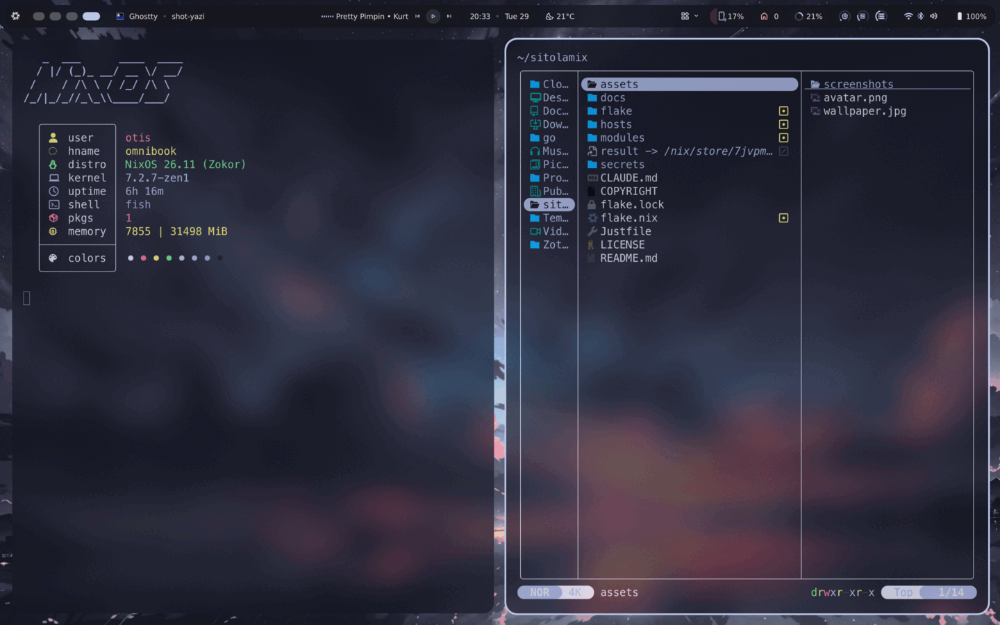
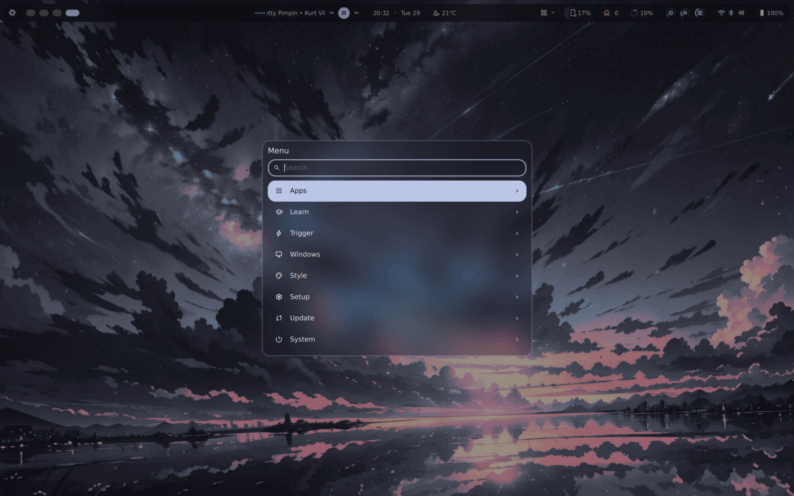
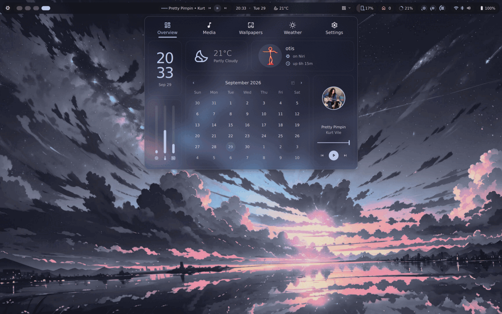
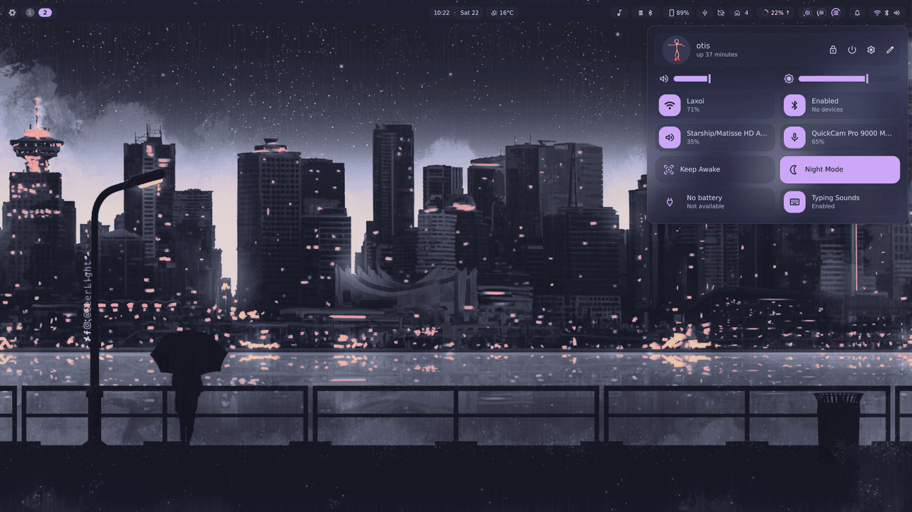
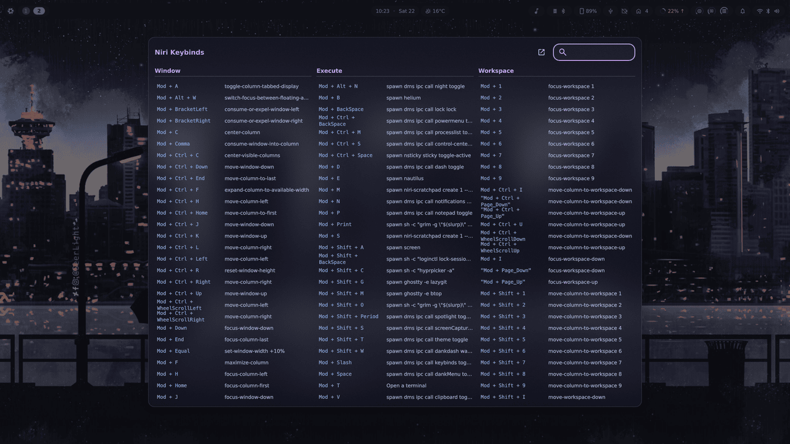
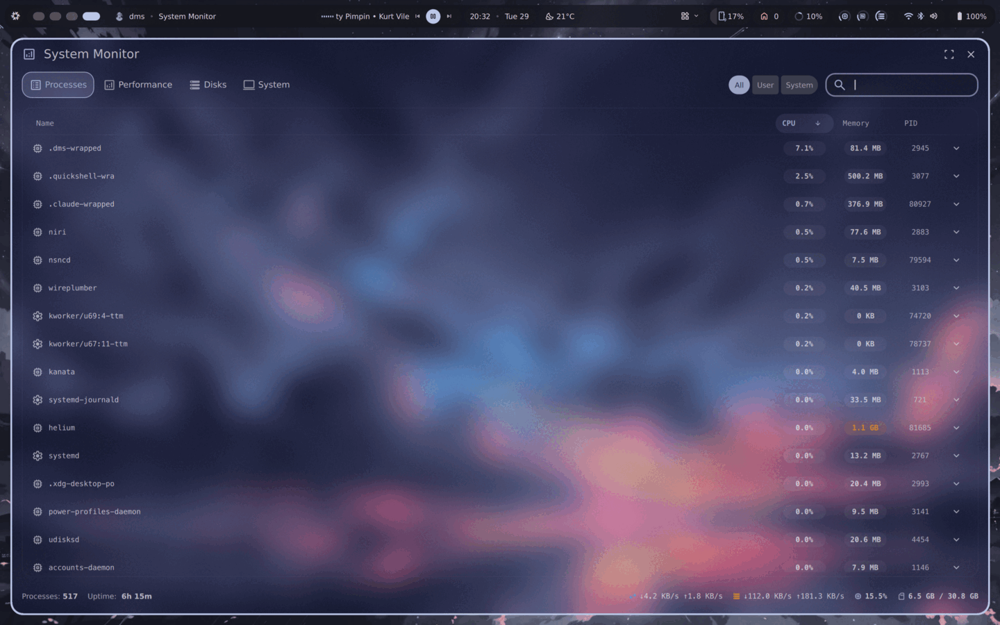
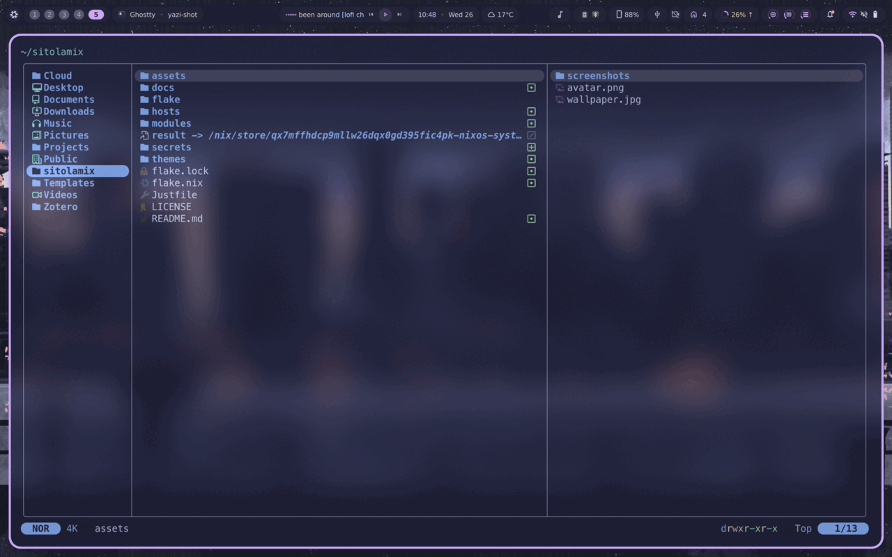
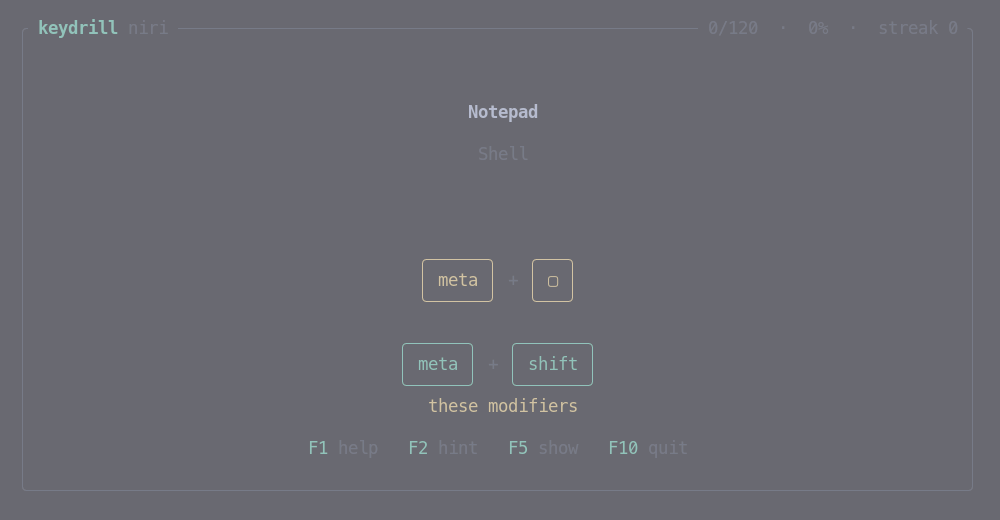
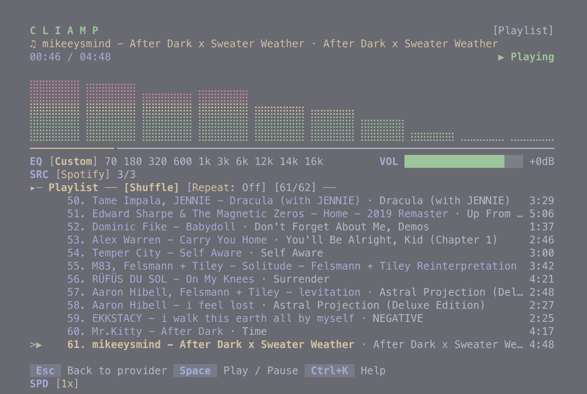
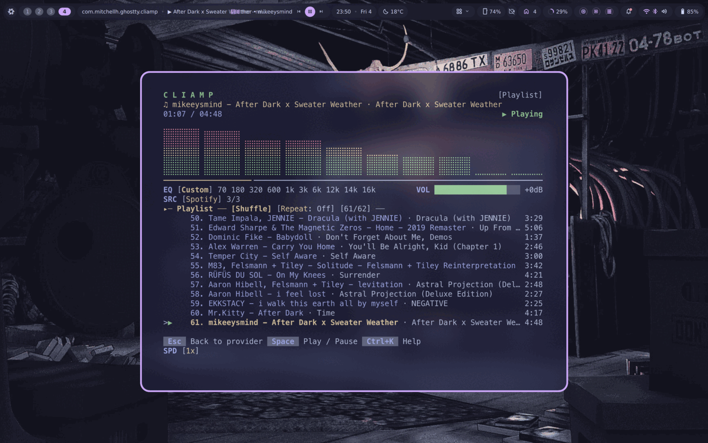

<div align="center">

# ❄️ sitolamix

**Personal NixOS flake** — a scrollable Wayland desktop wired together so that
every feature lives in **one file**: system config, home-manager, and its
enable-switch, side by side.

[](https://nixos.org)
[](https://github.com/YaLTeR/niri)
[](https://github.com/AvengeMedia/DankMaterialShell)
[](https://github.com/nix-community/home-manager)
[](https://github.com/AvengeMedia/DankMaterialShell)
[](https://claude.com/claude-code)
[](LICENSE)

</div>

<div align="center">



<em>niri + DankMaterialShell — nitch in a terminal on the left, yazi floating on the right, every colour taken from the wallpaper</em>

</div>

<details>
<summary><strong>More screenshots</strong> — the menu, the panels, the cheat sheet</summary>

<div align="center">

**`Mod+Space` — dankMenu**, the root menu: type to search every command *and* every app



**`Mod+D` — dank dash**: clock, weather, calendar, session and resource gauges in one panel



**`Mod+Ctrl+D` — control center**: network, bluetooth, audio, brightness and the plugin toggles (predates wallpaper theming)



**`Mod+Slash` — the keybind cheat sheet**, generated from the niri config itself (predates wallpaper theming)



**`Mod+Shift+D` — system monitor**: processes, performance, disks



**yazi** — the terminal file manager, with git status and full-border plugins (predates wallpaper theming)



</div>

</details>

---

## Overview

A single-user NixOS configuration built on three ideas:

- **One file per feature.** A module declares its `enable` option, gates its
  system config with `lib.mkIf`, *and* folds in its home-manager config — no
  parallel `home/` tree to keep in sync.
- **Nothing is imported by hand.** Every `.nix` under `modules/` is
  auto-imported; every folder under `hosts/` is auto-discovered. Adding a
  machine is adding a directory.
- **Suites over sprawl.** Hosts don't enable 40 options — they flip a handful of
  suites (`core`, `desktop`, `development`, …) that each switch on a batch.

## 🧩 Stack

| Layer | Choice |
|---|---|
| **Compositor** | [niri](https://github.com/YaLTeR/niri) — scrollable-tiling Wayland |
| **Shell / bar** | [DankMaterialShell](https://github.com/AvengeMedia/DankMaterialShell) (Quickshell) — bar, control center, notifications, lock screen, blur, plugins |
| **Launcher** | [dankMenu](https://github.com/sitolam/dms-plugins/tree/main/plugins/dankmenu) (`Mod+Space`) — omarchy-style root menu: one key to every command, with its own search and app list |
| **Terminal** | [ghostty](https://ghostty.org/) |
| **Login shell** | fish + [starship](https://starship.rs/) |
| **Files** | GNOME Files (nautilus) |
| **Browser** | [helium](https://helium.computer/) (default) + [zen](https://zen-browser.app/) — helium's flags, policies and extension set are declared in Nix |
| **Idle / lock** | swayidle → lock · DPMS · suspend (pauses while media plays) |
| **Theming** | DankMaterialShell's own [matugen](https://github.com/InioX/matugen) run — a Material 3 scheme derived from the current wallpaper; `theming.matugen.templates` registers a template per app so every themable surface follows |
| **Greeter** | [dank-greeter](https://github.com/AvengeMedia/dank-greeter) — greetd + DMS's own login screen, drawn per-output by the same niri build as the session, wearing a copy of the desktop's theme |
| **Keyboard** | [kanata](https://github.com/jtroo/kanata) home-row mods, system-wide |
| **Fonts** | Nerd Fonts + the Microsoft sets (corefonts, vista-fonts) so foreign documents keep their metrics |
| **Boot** | GRUB EFI + [catppuccin-grub](https://github.com/catppuccin/grub) |
| **Kernel** | linux-zen |

## ✨ Party tricks

Things this config does that a stock desktop does not:

- 🦷 **Mouth guard** — a webcam watches whether your mouth stays closed and nags
  from the bar when it doesn't ([`dms-plugins/mouthguard`](https://github.com/sitolam/dms-plugins/tree/main/plugins/mouthguard),
  MediaPipe Face Mesh on OpenVINO, built straight from the flake input).
- 🗂️ **One key to everything** — `Mod+Space` opens an omarchy-style root menu
  (see the screenshot above): drill in with `Enter`, out with `Esc`, or just
  type and it searches every command in the tree *and* every installed app
  ([`dms-plugins/dankmenu`](https://github.com/sitolam/dms-plugins/tree/main/plugins/dankmenu)).
  Its tree is generated from this flake, so `Update ▸ Rebuild` runs against
  this very checkout.
- ⌨️ **Home-row mods** — kanata turns `asdf`/`jkl;` into modifiers on hold, caps
  into Esc on tap, and holding `v` into a vim arrow layer — all of it below the
  compositor, so every app obeys.
- 🗃 **Scratchpad** — `Mod+M` stashes the focused window away, and floats it
  back on the second press (`niri-scratchpad`).
- 🎹 **Drill your own keybinds** — `Mod+Alt+P` opens
  [keydrill](https://github.com/sitolam/keydrill), a TUI trainer written for
  this config: it reads these binds live, asks what one does, and waits for
  you to *press* it. `Mod+Shift+Escape` switches every niri bind off on its
  own, which is what lets the terminal see `Mod+…` at all.

  
- 💡 **DDC brightness** — the brightness keys drive the *external* monitors over
  i2c, one `dms ipc` call per panel.
- 🤖 **Claude Code, two ways** — a bar widget that tracks API usage, and `ccl`,
  which points Claude Code at a model running locally in LM Studio.
- 🎧 **Bar full of plugins** — take-a-break, ambient sound, USB manager, KDE
  Connect, Home Assistant, emoji launcher, and a searchable list of every
  keybind the compositor has loaded.
- 🔣 **Launcher triggers** — type `=` for a calculator on
  [libqalculate](https://qalculate.github.io) (units, currencies, hex, result
  to the clipboard), in spotlight *and* dankMenu alike.
- 🎨 **Theming that goes inside apps** — DMS re-derives a Material 3 scheme from
  the current wallpaper and renders it into every `theming.matugen.templates`
  entry: spicetify rebuilds Spotify's CSS, Anki and Obsidian get matching
  colours. Pick a new wallpaper, they all follow — except Anki and Spotify,
  which only read their colour file at startup and need a restart.
- 📇 **Anki as config** — 23 addons deployed from Nix, credentials merged in
  from sops, and GUI-made settings still survive a rebuild (§ Anki).
- 🔒 **Lock before sleep** — swayidle locks, then suspends, and pauses the whole
  chain while media is playing.
- 🎬 **Right-click, download** — a yt-dlp browser extension in helium talks to a
  native-messaging host this flake ships; the video lands in `~/Videos` with a
  notification that opens it in mpv on click
  ([`modules/apps/ytdlp-download/`](modules/apps/ytdlp-download/)).

## ⌨️ Keybinds

Every bind follows one grammar, so a bind you have never pressed is guessable:

| Modifier | Meaning |
|---|---|
| `Mod` | act on the focused thing, or open the thing named by the key |
| `Mod+Shift` | move the focused thing |
| `Mod+Ctrl` | act one scope up — the monitor, or the workspace itself |
| `Mod+Alt` | on a nav key: move **without following**. On a letter: run a tool |

And `Shift+X` / `Ctrl+X` are always variants of `Mod+X` — nothing hides an
unrelated launcher behind a modifier.

<details>
<summary><code>Mod</code> is Super. <code>Mod+Slash</code> opens DMS's own searchable cheat sheet — this is the short version.</summary>

| Navigation | |
|---|---|
| `Mod+←/→` · `Mod+↑/↓` | focus column · focus window in column (`HJKL` too, everywhere below) |
| `Mod+Shift+←/→/↑/↓` | move it |
| `Mod+Ctrl+←/→/↑/↓` | focus that monitor; add `Shift` to send the column there |
| `Mod+U` / `Mod+I` | focus workspace up / down (`PgUp`/`PgDn` too) |
| `Mod+1`…`Mod+0` | focus workspaces 1–10 — `Mod+1` is the named `music` workspace, `Mod+2` the scratchpad's `stash` |
| `Mod+Shift+<n>` · `Mod+Alt+<n>` | send column to workspace *n*, following it · **staying put** |
| `Mod+Ctrl+<n>` · `Mod+Ctrl+U/I` | move the workspace itself — to index *n* · up/down |
| `Mod+Wheel` · `Mod+Shift+Wheel` | focus · move, same axes |

| Windows | |
|---|---|
| `Mod+Q` · `Mod+F` · `Mod+Shift+F` | close · maximise column · fullscreen |
| `Mod+W` · `Mod+Shift+W` · `Mod+Ctrl+W` | float · focus across float↔tiling · sticky |
| `Mod+A` · `Mod+C` | tabbed column · center column |
| `Mod+[` / `Mod+]` · `Mod+,` / `Mod+.` | consume / expel a window sideways · into / out of the column |
| `Mod+R` · `Mod+-` / `Mod+=` | preset widths · resize by 10% (`Shift` for height) |
| `Mod+O` · `Mod+Tab` · `Mod+M` | overview · previous workspace · scratchpad |

| Shell | |
|---|---|
| `Mod+Space` | dankMenu — root menu; `Enter`/`Esc` in and out, `Ctrl+HJKL` for vim navigation, type to search everything below |
| `Mod+D` · `Mod+Shift+D` · `Mod+Ctrl+D` | dank dash · process list · control center |
| `Mod+V` · `Mod+P` · `Mod+N` | clipboard · notepad · notifications |
| `Mod+Space`, then `=` / `\` | calculator · keybind search — launcher-plugin triggers, see § Party tricks |

| Apps & capture | |
|---|---|
| `Mod+T` · `Mod+B` · `Mod+E` | ghostty · helium · files |
| `Mod+S` · `Print` | capture toolbar · full screenshot |
| `Mod+Shift+S` · `Mod+Ctrl+S` | region → clipboard · region **OCR** → clipboard |

| `Mod+Alt+<letter>` — run a tool | |
|---|---|
| `G` · `M` · `A` | lazygit · btop · phone mirror |
| `C` · `F` | cliamp · Spotify — both floating and centred on the `music` workspace, see § cliamp |
| `S` · `E` | colour pick · emoji picker (also `Mod+F2`) |
| `P` | keydrill, with niri's binds off while it runs |
| `T` · `W` · `N` | theme · wallpaper · night mode |

| Session | |
|---|---|
| `Mod+BackSpace` | lock |
| `Mod+Shift+BackSpace` | lock + suspend |
| `Mod+Ctrl+BackSpace` | power menu |
| `Mod+Alt+BackSpace` | monitors off |
| `Mod+Shift+Escape` | practice mode: all binds off, same key back on |
| `Ctrl+Alt+Delete` | quit niri — the only bind that does |

Defined in `modules/desktop/niri/bindings.nix`. The full table, the two places
the grammar deliberately bends, practice mode, and the rules for adding a bind
are in
[`modules/desktop/niri/KEYBINDINGS.md`](modules/desktop/niri/KEYBINDINGS.md).
`Mod+Alt+P` drills them with [keydrill](https://github.com/sitolam/keydrill),
which reads this config at runtime rather than an exported copy.

</details>

## 🕹 Terminal toys

Because a tiling desktop deserves something in the empty column. The
animations and clocks ride along with the CLI tools in `modules/apps/cli.nix`;
`cliamp` and `cava` are media apps, so they live in `suites.media`:

| | |
|---|---|
| `cava` | audio visualiser — the same one the bar's widget uses |
| `lavat -g -c FF6AC1 -k 6AC1FF -G` | lava lamp: truecolor gradient, metaballs that rise and fall. `-p p1` for party mode |
| `pipes-rs` | the pipes screensaver, endlessly plumbing |
| `peaclock` | clock / timer / stopwatch, styled from its own config |
| `tty-clock -c -C 5` | the classic centred big-digit clock |
| `cbonsai -l` | grows a bonsai, live |
| `cmatrix -ab` | the green rain |
| `asciiquarium` | fish tank |
| `cliamp` | Winamp 2.x as a TUI — playlists, visualiser modes, themes, Lua plugins, Spotify/Qobuz. Configured declaratively, see § cliamp |

## 🖥 Hosts

| Host | Machine |
|---|---|
| `gamingpc` | AMD CPU + NVIDIA GPU workstation — DP-3 primary, HDMI-A-1 secondary. |
| `omnibook` | HP OmniBook laptop — Intel Core Ultra X7 358H (Panther Lake), Xe3 iGPU, LUKS+LVM root, IR face unlock. |

## 🗂 Structure

[`flake-parts`](https://flake.parts) + [`import-tree`](https://github.com/vic/import-tree):
every `.nix` under `modules/` is auto-imported into every host — **no manual
imports list** — and hosts under `hosts/<name>/` are **auto-discovered**.

```
flake.nix              flake description + inputs
flake.lock             every input pinned — including the Claude Code plugin set
flake/                 flake-parts modules (systems builder, devshell, formatter)
Justfile               the task runner — see § Rebuild
CLAUDE.md              house rules, auto-loaded by Claude Code in this repo
hosts/<name>/          per-host: default.nix (suite toggles) + hardware.nix
modules/
  hm.nix               home-manager bridge — the `home.extraOptions` mechanism
  system/              always-on baseline (base, nix, locale, users, boot, sops, openssh …)
  hardware/             audio / bluetooth / graphics baseline; nvidia + gaze gated
  desktop/              niri, dms, greetd, kanata, xdg (gated on the desktop suite)
  theming/               matugen — `theming.matugen.*`
  services/              kde-connect, docker, rclone, nas, printing, winapps … (gated)
  apps/                  one file (or directory) per app, each `apps.<name>.enable`
  suites/                groups that flip a batch of enables (core, desktop, dev …)
secrets/                sops-encrypted age ciphertext, one file per subsystem
docs/                   install walkthrough + the design docs behind each feature
assets/                 screenshots, wallpaper, avatar
```

Two conventions: **a module with sidecar files is a directory**
(`modules/apps/ccl/` carries `ccl.sh`; no sidecars means a single `.nix`
file), and **data that isn't a module goes in a `_`-prefixed directory** —
import-tree skips any path containing `/_`, so `modules/apps/anki/_lib/` holds
Anki's addon tree beside its module without being mistaken for one.

### Enable-options + suites

Each feature declares `options.<ns>.<name>.enable`, gated with `lib.mkIf`.
Suites toggle groups of them; hosts just flip suites:

```nix
# hosts/gamingpc/default.nix
suites = {
  core.enable = true;      # shell + CLI programs
  desktop.enable = true;   # niri + dms + matugen theming + greetd/dank-greeter
  development.enable = true;   # vscode, docker, tooling
  media.enable = true;
  gaming.enable = true;
};
hardware.nvidia.enable = true;
```

### home-manager in one file

Home-manager runs as a NixOS module (`modules/hm.nix`). Any file mixes system +
HM config by writing `home.extraOptions` — an attrset, or a function
`{ config, … }: { … }` when it needs HM's own `config` (e.g. font names from
`fonts.fontconfig.defaultFonts`). It's a `deferredModule`, so every file's
contribution merges into `home-manager.users.otis`. There is no separate
`home/` tree — see the example in [`CLAUDE.md`](CLAUDE.md#the-one-rule).

## 💾 Install

> [!WARNING]
> This is a personal config, not a distro. It hardcodes the username **`otis`**
> (45 references across 21 files — `grep -rn otis modules/`), and
> `hosts/gamingpc/hardware.nix` describes one specific machine: NVMe, AMD CPU,
> NVIDIA GPU. Fork it, or give your machine its own host directory. Installing
> `omnibook` specifically? [`docs/omnibook-install.md`](docs/omnibook-install.md)
> is the same procedure written end-to-end for that machine.

### 1. Boot the installer

Any recent [NixOS ISO](https://nixos.org/download/) (graphical or minimal).
Get networking up — `nmtui` on the minimal image — and become root: `sudo -i`.
Installing a laptop with Secure Boot or Intel RST/VMD enabled, or with
BitLocker on an existing Windows install? [`docs/omnibook-install.md`](docs/omnibook-install.md)
Parts 1–2 cover those firmware gotchas and the BitLocker warning in full, and
apply to any similar machine, not just `omnibook`.

### 2. Partition, and **label the partitions**

`hardware.nix` mounts `/dev/disk/by-label/NIXROOT` rather than a UUID, so the
same file works on any disk that uses these three names.

| label | mount | filesystem |
| --- | --- | --- |
| `NIXBOOT` | `/boot` | fat32, ESP, ~1 GiB |
| `NIXSWAP` | swap | swap, ~RAM-sized if you want hibernate |
| `NIXROOT` | `/` | ext4, the rest |

GParted works if you prefer clicking — just set those three labels. On the CLI,
for a disk at `/dev/nvme0n1` (**this erases it**):

```sh
parted /dev/nvme0n1 -- mklabel gpt
parted /dev/nvme0n1 -- mkpart ESP fat32 1MiB 1GiB
parted /dev/nvme0n1 -- set 1 esp on
parted /dev/nvme0n1 -- mkpart swap linux-swap 1GiB 17GiB
parted /dev/nvme0n1 -- mkpart root ext4 17GiB 100%

mkfs.fat -F32 -n NIXBOOT /dev/nvme0n1p1
mkswap        -L NIXSWAP /dev/nvme0n1p2
mkfs.ext4     -L NIXROOT /dev/nvme0n1p3

mount /dev/disk/by-label/NIXROOT /mnt
mkdir -p /mnt/boot
mount -o umask=077 /dev/disk/by-label/NIXBOOT /mnt/boot
swapon /dev/disk/by-label/NIXSWAP
```

`omnibook` uses LUKS2 + LVM instead of a plain disk — full detail, including
why the laptop gets encryption and the desktop doesn't, is in
[`docs/omnibook-install.md`](docs/omnibook-install.md).

### 3. Give your machine a host

The flake lives in `~`, not `/etc/nixos` — clone it straight to where it will
live after boot, so nothing has to be moved later:

```sh
nix-shell -p git
mkdir -p /mnt/home/otis
git clone https://github.com/sitolam/sitolamix /mnt/home/otis/sitolamix
cd /mnt/home/otis/sitolamix

mkdir -p hosts/myhost
nixos-generate-config --root /mnt --show-hardware-config > hosts/myhost/hardware.nix
cp hosts/gamingpc/default.nix hosts/myhost/default.nix
```

Edit `hosts/myhost/default.nix`: set `networking.hostName = "myhost"`, drop
`hardware.nvidia.enable` if you have no NVIDIA card, drop the `rclone` block,
and turn off any suites you don't want. Hosts are auto-discovered, so creating
the directory is all the registration there is. Generated UUIDs in
`fileSystems` work fine, or swap in the by-label ones from
`hosts/gamingpc/hardware.nix` if you labelled your partitions as above.

### 4. Re-key the secrets *before* installing

`modules/system/sops.nix` decrypts `secrets/home-assistant.yaml` with **this
machine's SSH host key**, converted to age. A new machine isn't a recipient
yet, so the build fails until you add it — and the key has to exist *before*
install, since the installed system otherwise only generates it on first boot:

```sh
mkdir -p /mnt/etc/ssh
ssh-keygen -t ed25519 -N "" -C "myhost" -f /mnt/etc/ssh/ssh_host_ed25519_key
chmod 600 /mnt/etc/ssh/ssh_host_ed25519_key   # back this up — USB stick or a password manager
nix run nixpkgs#ssh-to-age < /mnt/etc/ssh/ssh_host_ed25519_key.pub   # age1... — copy this
```

NixOS preserves an existing host key, so this becomes the key the installed
system decrypts with; lose it and the secrets are unrecoverable from this
machine. **On a machine that can already decrypt** (an existing install), add
the printed recipient to `.sops.yaml` next to `gamingpc`'s, then:

```sh
just updatekeys secrets/home-assistant.yaml     # asks for sudo, see § Secrets
git commit -am "chore(sops): add myhost as a recipient" && git push
```

Back in the installer, `cd /mnt/home/otis/sitolamix && git pull` — both
machines can now decrypt.

No machine that can decrypt (forking, or the old key is gone)? Replace the
`gamingpc` key in `.sops.yaml` with your own and write fresh ciphertext with
`nix run nixpkgs#sops -- secrets/home-assistant.yaml` — or, with no Home
Assistant at all, delete `modules/system/sops.nix` **and** the
`homeAssistantMonitor`/`haTokenPath` bits in `modules/desktop/dms/plugins.nix`
together, or evaluation breaks.

### 5. Install, then first boot

The installer ISO ships with flakes disabled, so enable them for this shell
first. This builds the whole system, so expect a long first run:

```sh
export NIX_CONFIG="experimental-features = nix-command flakes"
nixos-install --flake /mnt/home/otis/sitolamix#myhost   # or #omnibook
nixos-enter --root /mnt -c 'passwd otis'   # or greetd has nothing to let you in with
reboot
```

After first boot:

```sh
gh auth login              # so `git push` works — see GitHub auth below
rclone config               # only if you kept services.rclone
sudo chown -R otis:users ~/sitolamix   # it was cloned as root
```

On `omnibook`, face unlock still needs a one-off enrollment — see
[Face unlock](#-face-unlock-gaze) below. The checkout is already at
`~/sitolamix`, which is what the dankMenu `Update ▸ Rebuild` rows assume
(`flakeDir` in `modules/desktop/dms/plugins.nix`); from here on it is
`just rebuild`. Monitors are configured in DMS's settings UI, not the flake.

### Just trying it out?

No install needed — build the closure on any NixOS machine:
`nix build github:sitolam/sitolamix#nixosConfigurations.gamingpc.config.system.build.toplevel`.
Or cherry-pick: the modules are self-contained enough that copying
`modules/desktop/dms/` or a single `modules/apps/*.nix` into your own config
usually works, with only the `home.extraOptions` bridge (`modules/hm.nix`)
to port along with it.

## 🔧 Rebuild

Everything routine goes through the `Justfile`. `just` with no argument lists
the lot.

| Recipe | What it does |
|---|---|
| `just rebuild` | `nh os switch .` — build and activate this checkout |
| `just update` | `nix flake update`, then rebuild |
| `just check` | `nix flake check --no-build` |
| `just drybuild [host]` | dry-run build (defaults to `hostname`) |
| `just build [host]` | real build, leaves a `result` symlink |
| `just doctor` | `check` + `drybuild` — the pre-push gate |
| `just diff` | `nvd diff /run/current-system result` — what a build would change |
| `just fmt` | `nix fmt` (nixfmt via treefmt, walks the tree) |
| `just dms-reload` | restart the DankMaterialShell user service |
| `just outputs` / `just windows` | `niri msg outputs` / `niri msg windows` |
| `just secret <file>` | edit an encrypted secret — see § Secrets |
| `just updatekeys <file>` | re-encrypt a secret after adding a host |

Fish also wraps `just` so it works from any cwd (`modules/apps/fish.nix`). For
working *on* the flake, `nix develop` (or `direnv allow`) gives you `nvd`,
`deadnix`, `statix`, `nil`, `nixd`, `nh`, `just` and `nixfmt` without
installing any of them globally. After a rebuild that touches DankMaterialShell
plugins or settings, run `dms restart` so the shell reloads them.

## 🔑 GitHub auth

Pushing uses HTTPS with the **GitHub CLI** as the credential helper — no token
in the remote URL, nothing auth-related committed to the repo. On a new
machine, `gh auth login` (GitHub.com → HTTPS → login via browser); `gh` stores
the token in `~/.config/gh/` and wires itself in as git's credential helper,
so `git push` just works afterwards.

## 🔐 Secrets (sops)

<details>
<summary>Encrypted with <b>sops-nix</b> + age, committed as ciphertext, decrypted at activation to <code>/run/secrets/&lt;name&gt;</code> — tmpfs, never in the store or git in plaintext. The config references the decrypted <em>path</em>, never the value.</summary>

- `modules/system/sops.nix` — sops module, decryption key, and each secret's
  declaration.
- `.sops.yaml` — the age recipients allowed to decrypt.
- `secrets/*.yaml` — the encrypted secret files.

The decryption key is `/etc/ssh/ssh_host_ed25519_key`, converted to age.
Add or edit a secret with `just secret secrets/home-assistant.yaml` — it opens
`$EDITOR` with the decrypted content and re-encrypts on save. Plain `sops` on
that file fails, because sops only searches *user* key locations
(`~/.ssh/`, `~/.config/sops/age/keys.txt`); the recipe converts the root-only
host key to age and hands it to sops for that one command instead. Don't run
`sops` under `sudo` — it works, but rewrites the file as root.

```nix
# modules/system/sops.nix
sops.secrets.hass_token = { owner = "otis"; mode = "0400"; };
# consumer, e.g. modules/desktop/dms/plugins.nix
config.sops.secrets.hass_token.path   # => /run/secrets/hass_token
```

New machine: add its age key to `.sops.yaml`, then
`just updatekeys secrets/home-assistant.yaml` to re-encrypt everything.

</details>

## 🙂 Face unlock (gaze)

<details>
<summary><code>omnibook</code> only — the laptop's Windows Hello IR camera used as a login shortcut, via <a href="https://github.com/GunduLabs/gaze">gaze</a>, running its models on the NPU. Convenience, <b>not</b> a full security upgrade: read the warning first.</summary>

> [!WARNING]
> **Gaze is still not Windows Hello.** A local MiniFASNet-V2 liveness model
> runs on every detected face crop, so a photo held up to the camera is
> rejected — but it is one camera, not Hello's structured-light depth sensor.
>
> `modules/hardware/gaze.nix` is wired accordingly: the PAM rule is
> `sufficient` (a miss falls back to the password prompt, silently), scoped to
> `login`, `greetd`, `sudo` and `polkit-1` — never `sshd`. For face as a real
> second factor, set `security.pam.services.<svc>.gaze.control = "required"`
> on the host instead.

Gaze replaced howdy here: the password prompt is no longer blocked while the
scan runs (`pam_gaze_grosshack.so` races it concurrently), it does liveness
detection, and it dropped the dlib/Python stack howdy needed (−2.1 GiB
closure). Inference runs on the NPU (`hardware.gaze.device = "npu"`) via a
gaze build with the OpenVINO Cargo feature enabled, falling back to CPU if
OpenVINO fails to come up (`gaze doctor` shows which is live). Enrollment is
per-machine data under `/var/lib/gaze`, never committed.

### Setup

Find the IR node (`lsusb`, `v4l2-ctl --list-devices`, `gaze doctor`), then
point the config at it — a `usb:VVVV:PPPP` id survives `/dev/videoN`
renumbering; a `/dev/v4l/by-path/…` symlink does **not** work:

```nix
# hosts/omnibook/default.nix
hardware.gaze = {
  enable = true;
  irDevice = "usb:0408:5494";
  device = "npu";
};
```

`just rebuild`, then enrol (no `sudo` — it goes through the daemon over D-Bus,
authorized by polkit):

```sh
gaze add-face default          # guided multi-angle capture
gaze refine-face default       # add captures: glasses on/off, dim room
gaze auth --verbose            # test without locking anything
```

Lock the session (`Super+L`) to try it for real. If every frame is black, some
modules need their IR LEDs switched on: `hardware.gaze.irEmitter.enable = true;`.
`/etc/gaze/config.toml` is a read-only link to the Nix store, so the GTK4 app's
settings page can't save. Change `settings` in the module instead. Turn gaze off with
`hardware.gaze.enable = false;` — PAM goes back to password-only immediately;
templates stay under `/var/lib/gaze` until `gaze clear-user`.

</details>

## 💤 Idle, hibernate & display glitches

<details>
<summary><code>omnibook</code> only — sleep/hibernate timing, and three Xe3 display-engine bugs worked around with kernel params. Recheck the display params after every kernel bump.</summary>

**Idle & hibernate.** `modules/desktop/niri/idle.nix` runs the shared swayidle
timers (lock at 6 min, blank at 10 min, sleep at 15 min). `hosts/omnibook/default.nix`
adds lid-switch and hibernate-delay config, keyed off `boot.resumeDevice`
(only `omnibook` sets it — a no-op elsewhere). Lid close or 15 min idle →
`systemctl suspend-then-hibernate`: sleeps immediately, then after
`HibernateDelaySec` (30 min) still suspended, hibernates for real. On AC,
hibernate is skipped for plain suspend.

**Display (Panther Lake / Xe3).** The driver side is already correct
(`hardware.intelgpu.driver = "xe"`, `vaapiDriver = "intel-media-driver"`) —
video decode is not the problem. nixos-hardware has no Panther Lake module
yet, so the host sets these by hand; recheck after `nix flake update
nixos-hardware`. Two display-engine bugs are worked around with
`boot.kernelParams`: `xe.enable_dsb=0` (Display State Buffer errors that drop
frames) and PSR, dropped on 2026-08-26 to retest since it saves real idle
battery — if half-panel blackouts return, put `xe.enable_psr=0` back. VRR is
the third, still-open issue (`Atomic update failure` / `VRR push send still
pending` during video); it's toggled in DMS's settings UI, not Nix. Recheck a
param by dropping it, rebooting, and counting:

```bash
journalctl -k -b | command grep -cE "DSB 0 poll error|PSR idle state|FIFO underrun"
```

</details>

## ☁️ Cloud mounts (rclone)

<details>
<summary>Google Drive — and any other rclone remote — mounted at <code>~/Cloud/&lt;remote&gt;</code> by one systemd <b>user</b> service per remote. <em>Which</em> remotes to mount is declared in Nix; the accounts themselves are set up with <code>rclone config</code>, so no OAuth token ever touches the repo.</summary>

`modules/services/rclone.nix` turns every entry of `services.rclone.remotes`
into its own `rclone-<name>.service`:

```nix
# hosts/gamingpc/default.nix
services.rclone = {
  enable = true;
  remotes.gdrive_personal = { };   # mounts gdrive_personal: at ~/Cloud/gdrive_personal
};
```

Adding a Google Drive: [make your own OAuth client id](https://rclone.org/drive/#making-your-own-client-id)
(the built-in one is shared and rate-limited), `rclone config` once per
machine (interactive — cannot be declarative), then declare the remote and
`just rebuild`. `rclone-mounts [status|restart|start|stop|logs]` manages the
mounts. Default flags: `--vfs-cache-mode=full` (edits behave like local disk, capped at
5G/24h) and `--dir-cache-time=1000h` with `--poll-interval=15s` (Drive
supports change polling, so remote edits show up within seconds). Per-remote
options: `mountPoint`, `remote` (`<name>:Sub/Dir` to mount a subfolder),
`extraFlags`. `~/.config/rclone/rclone.conf` holds live OAuth refresh tokens —
stays in `$HOME` at mode `600`, never committed.

</details>

## 🗄️ NAS shares (SMB)

<details>
<summary>The home NAS's SMB shares mounted under <code>/mnt/nas/&lt;share&gt;</code> as real kernel <code>cifs</code> mounts, mounted automatically whenever the network comes up and listed in the Nautilus sidebar, with the share password held in sops.</summary>

`modules/services/nas.nix` turns each entry of `services.nas.shares` into a
`fileSystems` entry:

```nix
# hosts/<host>/default.nix
services.nas = {
  enable = true;
  server = "192.168.68.148";
  shares = [ "backup" "shared" "media" ];   # => /mnt/nas/backup, …
};
```

Mounts are `noauto`; a NetworkManager dispatcher script starts/stops them as
the network comes and goes, so a laptop away from home still boots normally.
Credentials live in `secrets/nas.yaml` (`nas_credentials`, a `mount.cifs`
credentials file, `just secret secrets/nas.yaml` to set):

```yaml
nas_credentials: |
  username=<smb user>
  password=<smb password>
```

`systemctl status mnt-nas-media.mount` shows if it's mounted and why not;
`sudo systemctl restart mnt-nas-media.mount` remounts after changing
credentials. Files show up owned by `otis` (SMB carries no usable Unix
ownership). The module also adds a GTK bookmark per share so it appears in
Nautilus even while idle-unmounted — restart the file manager (`nautilus -q`)
after a rebuild that changes the bookmark list.

</details>

## 🖨️ Printing (CUPS)

<details>
<summary>CUPS with driverless IPP discovery over Avahi/mDNS — printers on the LAN show up without typing an IP or installing a vendor driver.</summary>

Enabled for every host through `suites.core`
(`services.printing-cups.enable = true;`). Add a printer with
`system-config-printer` or the CUPS web UI at `http://localhost:631` — a
driverless/AirPrint/IPP-Everywhere printer on the LAN should just appear
(`lpstat -p` lists configured printers). If one needs a vendor driver, add it
to `services.printing.drivers` in `modules/services/printing.nix` (e.g.
`[ pkgs.hplip ]` for HP).

</details>

## 🤖 Local models (ccl)

<details>
<summary><code>ccl</code> runs Claude Code against a model served by LM Studio instead of Anthropic's API, via <a href="https://github.com/musistudio/claude-code-router">claude-code-router</a>, which translates between LM Studio's OpenAI API and Claude Code's Anthropic one. <code>ccl</code> picks the model, configures the router, starts it, and hands off.</summary>

Enabled by `suites.ai.enable`. Start LM Studio and load a model first — `ccl`
only lists what LM Studio reports. `ccl` picks a model interactively, `ccl
<model-id>` launches one directly, `ccl --list` lists selectable models. The
router runs detached and keeps serving across restarts of `ccl`, the shell, or
Claude Code — only `ccr stop` or logout ends it. "LM Studio is not answering"
means its local server is off (Developer tab → Status: Running); malformed
tool calls are usually the model, not `ccl` — expected with small quantised
models.

</details>

## 🪟 Windows apps (WinApps)

<details>
<summary>Microsoft Office runs in a Windows VM and shows up as ordinary windows — Word is a launcher entry, <code>.docx</code> opens in it, and there is no second desktop to alt-tab into. <code>modules/services/winapps/</code> holds the whole thing.</summary>

The VM does not start at boot — it costs ~4 GB RAM and steady CPU. Start it
from `Mod+Space` → Windows → Start VM, or `systemctl start docker-windows`.
**First boot, once per machine:** read the generated password (`sops -d
secrets/winapps.yaml`), start the VM, wait 20–40 minutes at the Web Console
(`http://127.0.0.1:8006`) while Windows and Office install unattended, then
sign in to Office once in that viewer — activation persists under
`/var/lib/winapps/storage`. After that, `Mod+Space` → an app name launches
Word/Excel/PowerPoint/Outlook/OneNote like any other app.

**On-Demand** (toggle in the Windows submenu) starts the VM on first use and
stops it after `services.winapps.idleTimeout` minutes (15 by default) idle;
off, you start and stop by hand. It's a full VM (QEMU/KVM), not a container,
so idle Windows still ticks over and costs real battery — stop it when done.
The home directory is redirected into the RDP session with nothing copied.
`services.winapps.rdpScale` must match the output scale (FreeRDP only accepts
100/140/180). Ports are loopback-only (`127.0.0.1:3389`, `127.0.0.1:8006`) —
don't drop those prefixes. Add an application via `services.winapps.apps`;
the `id` must name a directory in WinApps' own app list.

If WinApps says "another user is still signed in", the guest predates the
`AutoAdminLogon = 0` step (it only runs on a fresh install). Sign the console
out once via the web viewer on `127.0.0.1:8006`, then run this in an elevated
shell in the guest:

```bat
reg add "HKLM\SOFTWARE\Microsoft\Windows NT\CurrentVersion\Winlogon" /v AutoAdminLogon /t REG_SZ /d 0 /f
```

</details>

## 🎵 cliamp (declarative Winamp TUI)

<details>
<summary>Winamp 2.x as a terminal player: one config written from Nix, the Spotify provider on a sops-held client ID, and <code>Mod+Alt+C</code> to float it on workspace 10. <code>modules/apps/cliamp.nix</code>.</summary>



Enabled by `suites.media`. `~/.config/cliamp/config.toml` is written by an
activation script rather than symlinked, since cliamp rewrites it itself on
every runtime toggle — installed writable (0600) each rebuild, so Nix values
win again at the next `just rebuild`. Spotify provider is 320kbps (**needs
Premium**); its `client_id` lives in `secrets/cliamp.yaml`, expanded from the
environment at launch — missing it falls back to cliamp's shared built-in ID.
Register your own at [developer.spotify.com/dashboard](https://developer.spotify.com/dashboard)
(redirect URI `http://127.0.0.1:19872/login`, Web API enabled) and store it
with `just secret secrets/cliamp.yaml`.

`Mod+Alt+C` opens cliamp floating at 60%×60%; `Mod+Alt+F`
(`modules/apps/spotify/default.nix`) does the same for Spotify at 75%×80%.



</details>

## 📇 Anki (declarative addons)

<details>
<summary>23 addons deployed from Nix into Anki's <em>real</em> mutable addon folder — GUI config still survives rebuilds, two addons get their credentials from sops, and ReColor follows the current wallpaper. <code>modules/apps/anki/</code>.</summary>

`pkgs.anki.withAddons` was rejected — it replaces `addons21` wholesale and
breaks Anki's own "save config" flow. Instead a home-manager activation script
rsyncs addon *code* from the store on every rebuild, excluding `meta.json` and
`user_files/` — once those exist, Anki owns them, so GUI config sticks. Three
exceptions: `secretMerges` re-merges HyperTTS/Anki Leaderboard credentials
from `/run/secrets/*` with `jq` every activation; `themedFiles` rebuilds
ReColor's `meta.json` from `recolor-schema.json` every activation;
`disabledIds` keeps Anki Leaderboard off. ReColor's dark colours themselves
come from matugen: a rendered colours file feeds a `jq` post-hook
(`recolorApply`) that patches only the dark slot of the addon's live
`meta.json`. Anki only reads `meta.json` at startup, so a new wallpaper's
colours show up on the next launch, not while Anki is running.

`modules/apps/anki/default.nix` is the module; `_lib/fetched/` builds addons
from upstream sources, `_lib/vendored/` holds addons committed here (forks, or
no clean source), `_lib/seeds/` captures first-install `meta.json` per addon.
Adding one: from upstream, add it to `_lib/fetched/default.nix`; vendored,
drop the folder into `_lib/vendored/<id>/` and list it in `vendoredIds`.

</details>

## 🌐 Helium (declarative browser)

<details>
<summary>Flags, Chrome Enterprise policies and the whole extension set declared in Nix — including a local proxy that keeps the extension updater from breaking on Helium's version string. <code>modules/apps/helium/</code>.</summary>

Extensions are installed *by policy*, so the set, the pinning, and the
*absence* of anything removed all travel with the flake rather than with
`~/.config/net.imput.helium`. The catch-all `"*".installation_mode = "allowed"`
means the declared set is a floor, not a whitelist — to actually uninstall an
extension that used to be declared, add its id to `removedExtensions`.

Google's update endpoint rejects Helium's version string, so `update-proxy.py`
rewrites `prodversion` to a Chrome version it accepts — without it every
extension update 400s. uBlock Origin comes from the Web Store, not Helium's
own compiled-in copy; turn Helium's off by hand once per profile (Settings →
Services → uBlock) or every page gets two element pickers. Policies are read
at startup: **quit Helium completely and reopen it** before concluding a
change did not apply.

</details>

## 📱 Android (adb + scrcpy)

<details>
<summary><code>apps.android</code> — adb, scrcpy, and auto-reconnect to a phone paired over Wi-Fi, so mirroring is one command and never a USB cable hunt.</summary>

Enabled by `suites.development`.
Pair the phone once (Developer options → Wireless debugging → Pair device
with pairing code):

```sh
adb pair <phone-ip>:<pairing-port>
adb connect <phone-ip>:<port>
scrcpy
```

After that, wireless auto-connect handles reconnection, so `scrcpy` alone is
usually enough.

</details>

## 🔌 Claude Code (pinned plugins)

<details>
<summary>The plugin set is pinned by <code>flake.lock</code>, not cloned and self-updated by Claude — so a rebuild is the only thing that changes it. <code>modules/apps/claude-code.nix</code>.</summary>

Claude Code normally clones plugin marketplaces into `~/.claude/plugins` and
updates them on its own schedule. This module writes that tree from Nix
instead, so the plugin set is reproducible. Five marketplaces are `flake =
false` inputs holding a `.claude-plugin/marketplace.json`
(`claude-marketplace-official`, `-caveman`, `-skills`, `-flutter`, `-ui-ux`).
Four more plugins are pinned as their own single-repo inputs rather than read
out of a marketplace tree: `claude-plugin-superpowers` and `claude-plugin-figma`
(the official marketplace only points at them by URL), plus
`claude-plugin-mattpocock` and `claude-plugin-pstack` (not listed in any
marketplace this repo tracks). Bump one with `nix flake update <input-name>`,
then `just rebuild`.

[`CLAUDE.md`](CLAUDE.md) carries the conventions Claude Code loads
automatically in this repo — one file per feature, the namespace/directory
mapping, which files this repo owns that applications also try to write, and
the verification gates. `ccl` (§ Local models) execs `ccr code`, which
launches `claude`, so those sessions get this same pinned set.

</details>

## 📄 Licence

**GPL-3.0-or-later.** Copyright © 2026 Otis Lammertyn. Full text in
[`LICENSE`](LICENSE), the copyright notice and third-party carve-outs in
[`COPYRIGHT`](COPYRIGHT).

Two things the licence deliberately does *not* cover:

- **`modules/apps/anki/_lib/vendored/`** — Anki add-ons committed into this
  tree keep the licences their own authors chose. A per-add-on table is in
  [that directory's README](modules/apps/anki/_lib/vendored/README.md). Read
  it before redistributing any of them.
- **Everything behind a flake input** — nixpkgs, niri, DankMaterialShell,
  Helium, WinApps and the rest are fetched at build time under their own
  terms.

The two add-ons written for this repo, `advanced_deck_maker` and
`efficiency_tracker`, are GPL-3.0 like the rest of the configuration.

## 📎 Attribution

The HM + NixOS same-file mechanism (`home.extraOptions` + deferred module) and
the enable-options / suites layout are adapted from a previous personal repo,
`quickhyprnix`.

**Vibe coded with [Claude Code](https://claude.com/claude-code).** Nearly
every module here — and this README — was written in a conversation with
Claude rather than typed out by hand: describe the behaviour, read the diff,
rebuild, keep what survives. Comments in the `.nix` files stay short —
why something exists and, for a workaround, when it can be removed — rather
than a full design writeup; the design reasoning that doesn't fit that space
lives here, in this README and in `docs/`.

<div align="center"><sub>Built with Nix · themed with matugen, from the wallpaper · broken and fixed on <code>main</code></sub></div>
